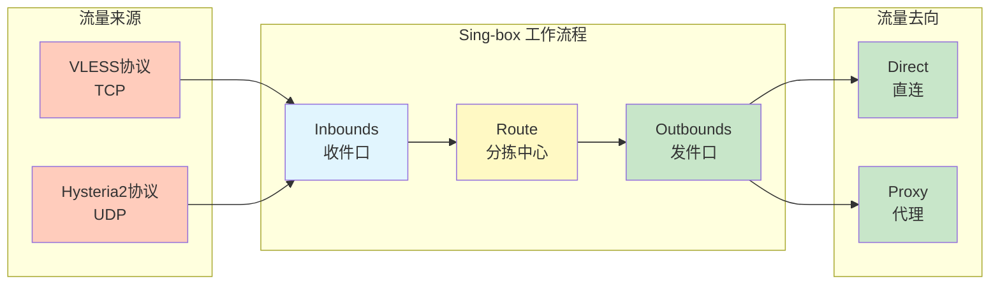
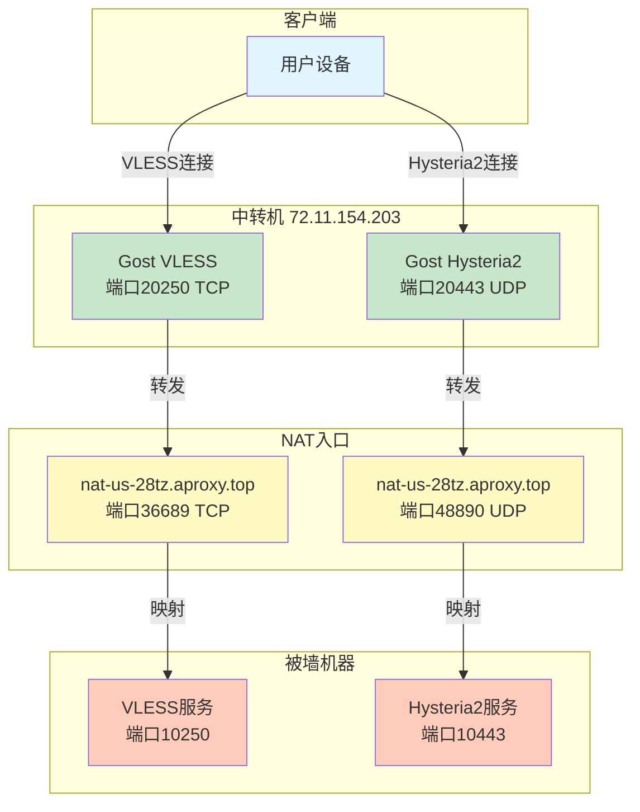
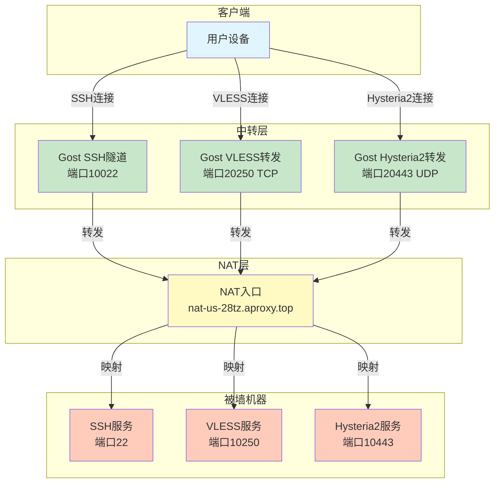

# 【进阶实战】Sing-box全能改造：在被墙NAT机器上共存Hysteria2与VLESS-Reality

**作者：** GLM4.7  
**时间：** 2025年12月  
**字数：** 约3000字  
**阅读时间：** 12分钟  

> 这是一个非常棒的进阶选题。上一篇我们讲的是"救活"，这一篇我们讲"强身健体"和"内功修炼"。这次我们将深入Linux系统的操作核心，剖析Sing-box的配置逻辑，并在那台被墙的NAT机器上同时部署**Hysteria2（UDP战神）**和**VLESS-Reality（TCP稳如老狗）**，通过中转机进行双协议分流。

---

## 🌟 前言：为什么要"双修"？

在上一篇教程中，我们通过Gost中转+VLESS-Reality成功复活了被墙的机器。很多读者问：**"既然能用，为什么还要折腾Hysteria2？"**

原因很简单：**网络环境是动态的。**

| 协议类型 | 特点 | 优势 | 劣势 |
|---|---|---|---|
| **TCP（VLESS）** | 稳重，穿透性好 | 抗封锁能力强，连接稳定 | 拥塞控制较慢，晚高峰看4K可能会卡 |
| **UDP（Hysteria2）** | 暴力，基于UDP的拥塞控制 | 在丢包环境下速度极快，能跑满带宽 | 容易被运营商QoS（限速） |

**成年人的选择是：我全都要。**

我们将在一台机器上同时运行这两种协议，互为备份。同时，本篇将补全作为一名"服务器玩家"必备的Linux基本功。

---

## 🛠️ 第一章：清理门户（卸载与清理）

在开始新的部署前，我们需要一个干净的环境。如果你照着上一篇安装了Sing-box，这里教你如何优雅地"毁灭痕迹"。

### 1. 停止服务

Linux中管理后台服务通常使用 `systemctl`。

```bash
systemctl stop sing-box    # 停止运行
systemctl disable sing-box # 禁止开机自启
```

### 2. 删除文件

Sing-box的官方脚本通常将文件放在以下位置：

| 文件类型 | 路径 |
|---|---|
| 二进制文件 | `/usr/bin/sing-box`或者`/usr/local/bin/sing-box` |
| 配置文件目录 | `/etc/sing-box/` |
| 服务文件 | `/etc/systemd/system/sing-box.service` |

**执行清理命令**：

```bash
rm -f /usr/local/bin/sing-box
rm -f /usr/bin/sing-box
rm -rf /etc/sing-box
rm -f /etc/systemd/system/sing-box.service
systemctl daemon-reload  # 通知系统服务配置已变动
```

> 🧹 **知识点**：`rm` 是 remove 的缩写。`-rf` 参数中，`r` 代表递归（删除文件夹内所有内容），`f` 代表强制（不询问）。**慎用 `rm -rf /`，那会删库跑路！**

---

## 📝 第二章：Linux生存指南（Vim与Nano）

在配置Sing-box时，我们需要编辑 `.json` 配置文件。不会用终端编辑器是新手的最大噩梦。这里只教你够用的核心操作。

### 选手一：Nano（新手推荐，像记事本）

如果你是Linux小白，请使用Nano。

| 操作 | 快捷键 | 说明 |
|---|---|---|
| 打开文件 | `nano config.json` | 打开或创建文件 |
| 编辑 | 直接打字 | 像在Windows记事本里一样 |
| 保存 | `Ctrl + O`，然后 `Enter` | 确认文件名 |
| 退出 | `Ctrl + X` | 退出编辑器 |

### 选手二：Vim（老鸟必备，效率神器）

如果你想在Linux路上走得更远，必须掌握Vim。Vim有三种模式，我们只用两种。

| 操作 | 快捷键 | 说明 |
|---|---|---|
| 打开文件 | `vim config.json` | 打开或创建文件 |
| 进入编辑模式 | 按 `i` 键 | 左下角出现 `-- INSERT --` |
| 回到命令模式 | 按 `Esc` 键 | 左下角 `-- INSERT --` 消失 |
| 保存并退出 | `:wq` 然后 `Enter` | `w`=write保存, `q`=quit退出 |
| 不保存强制退出 | `:q!` 然后 `Enter` | 放弃所有修改 |

### 选手三：Cat

如果你不想学习 Vim 和 Nano，或者配置文件很长（比如 JSON），这个方法最适合你！

**核心思路**：在 Windows 电脑上用熟悉的编辑器写好内容，复制到剪贴板，然后通过 SSH 连接 VPS，使用 `cat` 命令直接写入文件。

#### 操作步骤

1. **在 Windows 上准备内容**
   - 使用 VS Code、Notepad++ 或记事本打开你的配置文件
   - 编辑完成后，全选复制（`Ctrl + A`，然后 `Ctrl + C`）

2. **连接到 VPS**
   ```bash
   ssh root@your-vps-ip
   ```

3. **使用 cat 命令写入文件**
   ```bash
   cat > /etc/sing-box/config.json
   ```
   执行这个命令后，终端会等待输入。

4. **粘贴内容**
   - 在终端中右键点击（或使用 `Ctrl + V`，取决于你的 SSH 客户端）
   - 粘贴刚才复制的所有内容

5. **结束输入**
   - 按 `Ctrl + D` 键结束输入并保存文件

> 💡 **小贴士**：
> - 如果文件已存在，`cat >` 会覆盖原文件
> - 如果想在文件末尾追加内容，使用 `cat >>` 代替 `cat >`
> - 这个方法特别适合长配置文件，避免了在终端中逐行编辑的痛苦

#### 示例：完整操作流程

```bash
# 1. 连接到 VPS
ssh root@72.11.154.203

# 2. 创建目录（如果需要）
mkdir -p /etc/sing-box

# 3. 使用 cat 写入配置文件
cat > /etc/sing-box/config.json
# 此时粘贴你的 JSON 配置内容，然后按 Ctrl + D

# 4. 验证文件内容
cat /etc/sing-box/config.json

# 5. 检查配置语法
sing-box check -c /etc/sing-box/config.json
```

**适用场景对比**：

| 方法 | 适合人群 | 优点 | 缺点 |
|---|---|---|---|
| **Nano** | Linux 新手 | 操作简单，像记事本 | 不适合超长文件 |
| **Vim** | Linux 老手 | 效率高，功能强大 | 学习曲线陡峭 |
| **Cat** | 配置文件较长 | 无需学习，适合长文件 | 无法在终端中修改 |

---

## 🧠 第三章：Sing-box 原理深究

Sing-box 之所以强大，是因为它的架构非常清晰，采用了 **Inbound（入站）** -> **Route（路由）** -> **Outbound（出站）** 的逻辑。

你可以把它想象成一个**邮局**：



### 1. Inbounds（收件口）

这里定义了流量**从哪里来**，**怎么进来的**。

比如：我们这次要开两个收件口，一个收VLESS协议（TCP），一个收Hysteria2协议（UDP）。

### 2. Outbounds（发件口）

这里定义了流量**要去哪里**。

比如：访问百度的流量走 `direct`（直连），访问Netflix的流量走 `proxy`（代理）。对于服务端来说，主要就是 `direct`（把用户的数据发给目标网站）。

### 3. Config Structure（配置文件结构）

Sing-box 使用 JSON 格式。一个标准的 JSON 就像千层饼，大括号套中括号。

```json
{
  "log": { ... },       // 日志设置
  "inbounds": [ ... ],  // 入站列表（重点）
  "outbounds": [ ... ], // 出站列表
  "route": { ... }      // 路由规则（服务端通常不需要复杂路由）
}
```

---

## 🚀 第四章：实战部署（服务端）

### 环境假设

| 服务器 | 配置信息 | 说明 |
|---|---|---|
| **被墙NAT机器（Target）** | 内网IP：`192.168.105.65` | 目标服务器 |
| **NAT端口映射1 (TCP)** | `10250` (内网) -> `36689` (公网) | 用于VLESS |
| **NAT端口映射2 (UDP)** | `10443` (内网) -> `48890` (公网) | 用于Hysteria2 |

> ⚠️ **注意**：请务必在NAT面板确认 UDP 转发已开启！

### 1. 重新安装 Sing-box

```bash
bash <(curl -fsSL https://sing-box.app/install.sh)
```

### 2. 生成必要的证书

Hysteria2 必须使用 TLS 加密。由于机器被墙且无域名，我们使用 Sing-box 自带的工具生成**自签名证书**。

```bash
# 建立存放证书的目录
mkdir -p /etc/sing-box/cert

# 生成自签名证书 (使用 openssl，有效期10年)
# 如果提示 openssl 未找到，请先执行 apt install openssl -y
openssl req -x509 -newkey ec -pkeyopt ec_paramgen_curve:P-256 -sha256 -days 3650 \
  -subj "/CN=bing.com" -nodes \
  -keyout /etc/sing-box/cert/key.pem -out /etc/sing-box/cert/cert.pem
```

这里我们将证书伪装成 `bing.com`，虽然是自签名的，但配合客户端的 `insecure` 模式即可使用。

### 3. 获取 UUID 和 Reality Key

```bash
sing-box generate uuid          # 复制这个 UUID
sing-box generate reality-keypair # 复制 PrivateKey 和 PublicKey
```

### 4. 编写"双修"配置文件

使用 `nano /etc/sing-box/config.json`，清空原有内容，粘贴以下配置（请仔细阅读注释并修改对应参数）：

```json
{
  "log": {
    "level": "info",
    "timestamp": true
  },
  "inbounds": [
    {
      "type": "vless",
      "tag": "vless-in",
      "listen": "::",
      "listen_port": 10250, 
      "users": [
        {
          "uuid": "你的UUID填在这里",
          "flow": "xtls-rprx-vision"
        }
      ],
      "tls": {
        "enabled": true,
        "server_name": "www.microsoft.com",
        "reality": {
          "enabled": true,
          "handshake": {
            "server": "www.microsoft.com",
            "server_port": 443
          },
          "private_key": "你的Reality_PrivateKey填在这里",
          "short_id": [""]
        }
      }
    },
    {
      "type": "hysteria2",
      "tag": "hy2-in",
      "listen": "::",
      "listen_port": 10443,
      "users": [
        {
          "password": "设置一个强密码"
        }
      ],
      "tls": {
        "enabled": true,
        "certificate_path": "/etc/sing-box/cert/cert.pem",
        "key_path": "/etc/sing-box/cert/key.pem"
      }
    }
  ],
  "outbounds": [
    {
      "type": "direct",
      "tag": "direct"
    }
  ]
}
```

> ⚠️ **重点检查**：
> 1. `listen_port`: 10250 对应 VLESS (TCP)，10443 对应 Hysteria2 (UDP)。
> 2. `certificate_path`: 确保刚才生成的证书路径正确。

### 5. 启动并验证

```bash
sing-box check -c /etc/sing-box/config.json # 检查配置文件语法
systemctl daemon-reload                      # 重新加载服务配置（重要！）
systemctl restart sing-box                   # 重启服务以应用新配置
systemctl status sing-box
```

> 💡 **常见报错：Device or resource busy**
> 如果遇到此报错且 `status` 显示 `Loaded: error`，通常是因为：
> 1. **旧进程未停止**：端口被之前的 Sing-box 进程占用了。尝试 `pkill -9 sing-box` 强制杀死。
> 2. **服务配置变更**：你删除了旧的服务文件或重新安装了。必须执行 `systemctl daemon-reload`。
> 3. **应该用 restart**：如果服务已在运行，`start` 可能会报错，请使用 `restart`。

如果状态是 `active (running)`，恭喜，服务端配置完成。

---

## 🌉 第五章：中转机配置（Gost转发）

现在我们有一台配置好的被墙机器，但直接连不上。我们需要在中转机（`72.11.154.203`）上架设两座桥梁。

我们需要两个Gost容器：一个转TCP，一个转UDP。



### 1. 转发 VLESS (TCP)

```bash
# 将中转机的 20250 (TCP) 转发到 NAT入口的 TCP端口
docker run -d --restart=always --net=host --name gost-vless \
    ginuerzh/gost \
    -L tcp://:20250/nat-us-28tz.aproxy.top:36689
```

**参数详解**：
- `-L tcp://:20250`：监听本机TCP 20250端口
- `/nat-us-28tz.aproxy.top:36689`：将收到的流量转发给目标的NAT入口地址
- `--net=host`：使用宿主机网络栈，性能最佳
- `--restart=always`：容器自动重启，确保服务稳定

### 2. 转发 Hysteria2 (UDP)

```bash
# 将中转机的 20443 (UDP) 转发到 NAT入口的 UDP端口
# 注意：这里必须用 udp://
docker run -d --restart=always --net=host --name gost-hy2 \
    ginuerzh/gost \
    -L udp://:20443/nat-us-28tz.aproxy.top:48890
```

---

## 💻 第六章：客户端配置（关键！）

这里以 **v2rayN** 或 **Sing-box** 客户端为例。地址统一填写 **中转机IP** (`72.11.154.203`)。

### 节点 A：VLESS-Reality (TCP)

| 配置项 | 值 |
|---|---|
| **地址** | `72.11.154.203` |
| **端口** | `20250` (Gost监听的端口) |
| **流控** | `xtls-rprx-vision` |
| **SNI** | `www.microsoft.com` |
| **公钥** | 你的 Reality Public Key |

### 节点 B：Hysteria2 (UDP) - ⚠️ 特殊配置

由于我们用的是自签名证书，客户端必须开启"跳过证书验证"。

| 配置项 | 值 |
|---|---|
| **地址** | `72.11.154.203` |
| **端口** | `20443` (Gost监听的UDP端口) |
| **密码** | 你设置的强密码 |
| **SNI** | `bing.com` (我们在生成证书时写的名字) |
| **允许不安全 (Insecure)** | **必须开启** (True) |
| **Obfs (混淆)** | 无 (本教程未配置，如果NAT UDP不稳定建议后续研究混淆) |

---

## 🔬 调试与故障排查（Debug技术）

在NAT环境下玩UDP（Hysteria2）很容易翻车，如果Hy2连不上，请按以下步骤排查：

### 1. 检查中转机的UDP转发

在中转机上，确保 Gost 的 UDP 转发容器正在运行。如果 Gost 转发 UDP 不稳定，可以尝试使用更简单的端口转发工具。

> ⚠️ **Hy2 专用：更稳定的 UDP 转发命令**
> 有些版本的 Gost 对 QUIC (UDP) 的长连接处理不佳，你可以尝试换成这个更直接的转发方式：
> ```bash
> docker run -d --restart=always --net=host --name gost-hy2 \
>     ginuerzh/gost \
>     -L udp://:20443/nat-us-28tz.aproxy.top:48890?ttl=60s
> ```
> *注意添加了 `?ttl=60s`，这有助于保持 UDP 会话活跃。*

### 2. 验证真正的 UDP 连通性

不要只用 `nc -z`，那不准。请在 **被墙机器** 上暂时停止 sing-box，手动运行一个 UDP 监听：

```bash
# 在被墙机器执行
nc -u -l 10443
```

然后从 **中转机** 发送测试数据：

```bash
# 在中转机执行
echo "hello-hy2" | nc -u -v 127.0.0.1 20443
```

如果被墙机器的屏幕上出现了 `hello-hy2`，说明中转链路没问题。如果没有出现，说明：
1. **中转机防火墙**：没开 20443 UDP 入站。
2. **NAT 商防火墙**：没开 UDP 转发。
3. **NAT 映射错误**：公网端口和内网端口没对上。

### 3. 客户端设置：MTU 是关键

Hysteria2 对数据包大小（MTU）非常敏感。如果你的中转线路经过了多次 NAT，数据包可能会因为太大而被丢弃，导致 `timeout`。

**解决方案**：在客户端配置中，手动限制下载/上传带宽，并尝试开启 `hop_interval` 或减小 MTU（如果客户端支持）。

**最常见的客户端漏项**：
- **Allow Insecure**：必须勾选（因为是自签名证书）。
- **SNI**：必须填写 `bing.com`（与生成证书时一致）。

---

### 4. 检查Sing-box实时日志

在被墙机器上：

```bash
systemctl stop sing-box
# 直接在前台运行以观察实时日志
/usr/bin/sing-box run -c /etc/sing-box/config.json
```

> ⚠️ **常见致命错误 (FATAL)**
> 如果看到 `FATAL[0000] start service: ...`，请检查：
> 1. **端口占用**：你刚才测试用的 `nc -u -l 10443` 是否没关？执行 `pkill -9 nc` 杀死它。
> 2. **证书缺失**：报错信息里是否有 `no such file or directory`？检查 `/etc/sing-box/cert/` 下是否有 `cert.pem` 和 `key.pem`。
> 3. **配置错误**：检查 JSON 里的 UUID、端口号是否填错，是否有漏掉的大括号。

用客户端连接，观察屏幕有没有滚动的日志：

| 现象 | 可能原因 | 解决方案 |
|---|---|---|
| 没有日志 | 流量根本没到被墙机器 | NAT商家的UDP映射没做好，或者Gost没配对 |
| 报错 `tls: bad certificate` | 客户端没开 `Insecure` 模式 | 客户端开启"允许不安全"选项 |
| 报错 `connection refused` | 端口未正确映射或监听 | 检查NAT端口映射和Sing-box配置 |

---

## 📚 总结

通过这两篇文章，我们完成了一次从"救砖"到"魔改"的华丽转身。

### 核心收获

| 技能领域 | 掌握内容 |
|---|---|
| **Linux技能** | `systemctl` 服务管理和 `nano/vim` 文本编辑 |
| **Sing-box精通** | 理解 Inbound/Outbound 结构，学会编写多协议共存的 JSON |
| **网络工程** | 实现 TCP 与 UDP 的分离转发，利用中转机彻底绕过GFW的IP封锁 |

### 技术架构图



### 关键技术点总结

| 技术点 | 关键配置 | 注意事项 |
|---|---|---|
| **Gost隧道** | `-L tcp://:本地端口/目标地址:目标端口` | 使用`--net=host`提升性能 |
| **Reality协议** | `server_port: 443` | 必须显式指定，否则使用0端口 |
| **Hysteria2证书** | 自签名证书 + insecure模式 | 适用于无域名环境 |
| **双协议共存** | 不同端口 + 不同协议 | TCP/UDP分离，互为备份 |

现在，你拥有了一个既能抗封锁（Reality）又能跑满带宽（Hysteria2）的超级节点。尽情享受探索技术的乐趣吧！

> **课后作业**：
> 既然 Sing-box 支持 `outbounds` 路由，你能否研究一下，如何配置让这台被墙机器访问 ChatGPT 时走 IPv6，而访问其他网站走 IPv4？（提示：NAT 机器通常有 IPv6）

---

## 🔗 参考资源

- [Sing-box官方文档](https://sing-box.sagernet.org/)
- [Gost官方文档](https://github.com/ginuerzh/gost)
- [Hysteria2官方文档](https://v2.hysteria.network/)
- [VLESS协议规范](https://xtls.github.io/config/protocols/vless.html)
- [Reality协议说明](https://github.com/XTLS/Reality)

