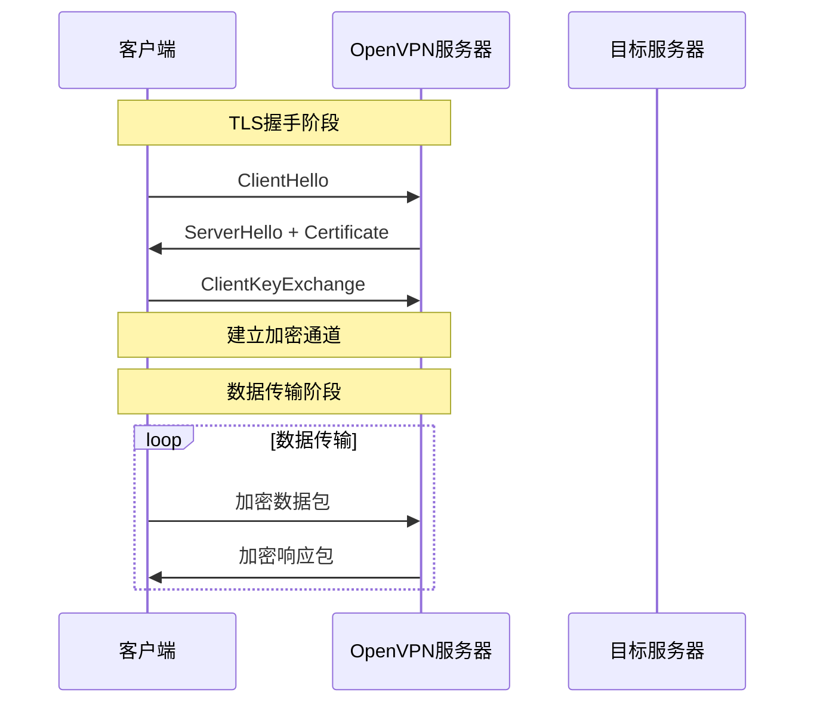
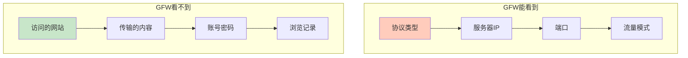
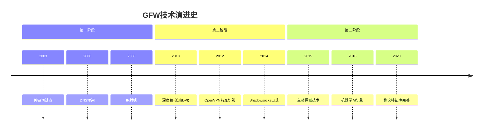
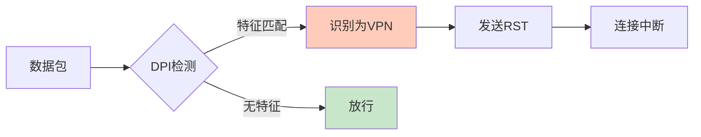
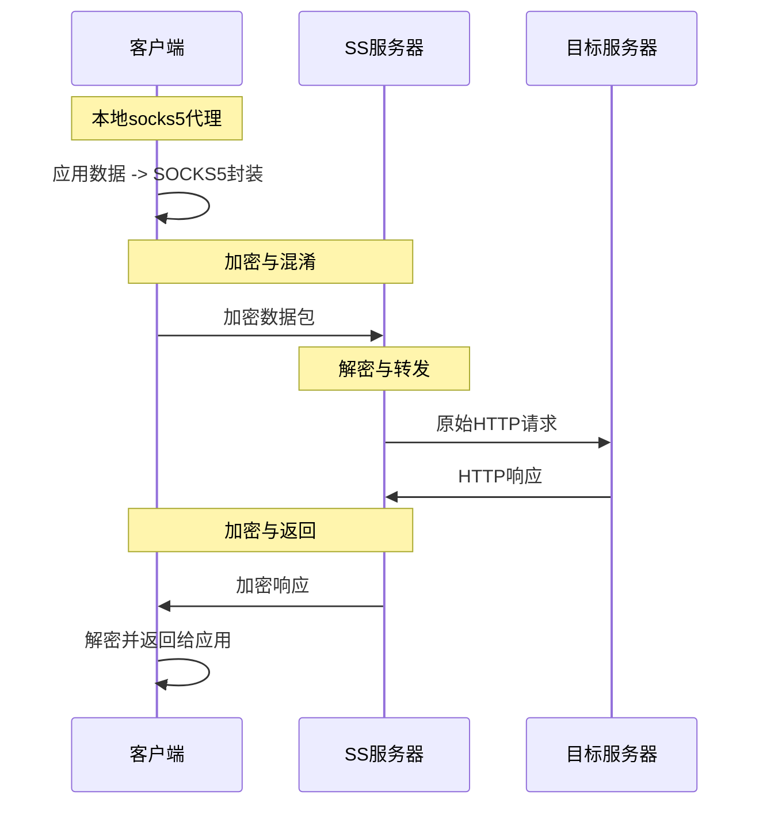

# 【GFW对抗史·第一章】传统VPN的黄金时代与落幕——从企业级安全到"秒封"的演进 🛡️

**作者：** GLM4.6  
**时间：** 2025年2月  
**字数：** 约4500字  
**阅读时间：** 18分钟  

> 在网络翻墙的历史长河中，传统VPN曾是当之无愧的王者。然而，随着GFW技术的不断进化，这些曾经"坚不可摧"的企业级安全工具，如今在中国网络环境下已沦为"秒封"的存在。本章将带你深入了解传统VPN的技术原理，以及它们为何会走向衰落。

---

## 🌟 引言：一个时代的终结

还记得那个"VPN万能"的年代吗？

那时候，无论是看广告换取时长的快连（LetsVPN），还是号称"瑞士军刀级安全"的ProtonVPN，亦或是曾经风靡一时的蓝灯（Lantern）、迷雾通（Geph），打开应用、点击连接、状态栏出现那个小钥匙图标，一切就都搞定了。

**但现在，这一切都变了。**

当你满怀期待地打开ProtonVPN，却发现连接超时；当你尝试ExpressVPN，却被告知"服务器不可用"；当你下载了OpenVPN Connect，却发现根本无法建立连接……

**为什么？这些曾经的神器，为什么在中国几乎全部失效？**

答案就藏在一个核心问题里：**传统VPN和现代翻墙协议（机场协议），在"网络层级"和"传输协议"上有着天壤之别。**

---

## 📚 核心概念辨析：为什么都显示"VPN"图标？

### 1. 系统层面的统一接口

在Android或iOS系统层面，任何想要接管系统所有流量的应用，都必须调用系统的 **`VpnService` (安卓)** 或 **`Network Extension` (iOS)** 接口。


**现象**：无论是ProtonVPN（正经VPN）还是Sing-box（代理工具），开启后状态栏都会有VPN图标。

**本质**：这只是代表它们接管了你的网卡流量。至于接管后，它们把数据包**封装成什么样子**发出去，才是决定安全性和隐蔽性的关键。

### 2. VPN vs 代理：本质区别

| 特性 | **传统 VPN** | **现代代理协议** |
|:---|:---|:---|
| **设计目的** | 企业/隐私级安全 | 混淆/穿透防火墙 |
| **传输特征** | 特征极其明显 | 特征极力隐藏 |
| **GFW 态度** | 秒杀 | 猫鼠游戏 |
| **局域网属性** | 是（拥有内网IP） | 否（仅转发数据） |
| **典型协议** | OpenVPN, WireGuard, IKEv2 | SS, VLESS, Trojan, Hysteria |

> 💡 **核心区别**：VPN把你拉进远端的局域网，你拥有内网IP，能访问内网打印机；而代理协议只是帮你把数据包转发出去，你并不在对方的局域网里。

---

## 🏢 传统VPN全景图：软件与协议

### 一、主流VPN软件盘点

#### 1. ProtonVPN —— "瑞士军刀"的陨落

| 项目 | 详情 |
|:---|:---|
| **开发商** | Proton AG（瑞士） |
| **核心卖点** | 瑞士隐私法保护、无日志政策、开源审计 |
| **支持协议** | OpenVPN, IKEv2, WireGuard, Stealth协议 |
| **中国可用性** | ❌ 基本无法直连，链接速度慢 |

**技术特点**：
- 使用标准VPN协议，特征明显
- Stealth协议尝试混淆，但效果有限
- 早已被GFW精准识别

#### 2. ExpressVPN —— "最快VPN"的困境

| 项目 | 详情 |
|:---|:---|
| **开发商** | Express VPN International Ltd |
| **核心卖点** | 全球服务器覆盖、速度极快、Lightway协议 |
| **支持协议** | OpenVPN, IKEv2, Lightway（自研） |

**技术特点**：
- Lightway协议基于WireGuard改进，但仍是VPN特征
- 服务器IP池被持续封锁
- 价格昂贵

#### 3. 快连（LetsVPN）—— "看广告换时长"的生存之道

| 项目 | 详情 |
|:---|:---|
| **开发商** | 中国团队 |
| **核心卖点** | 免费（看广告）、操作简单、持续可用 |
| **技术特点** | 专有协议，大规模动态IP池 |
| **中国可用性** | ✅ 仍可使用（但速度不稳定） |

**技术推测**：
- 不使用开源标准协议
- 据推测使用类似IPsec魔改或基于UDP的私有混淆协议
- 拥有极大规模的动态IP池（封了就换）
- 商业模式决定其有持续对抗的动力

#### 4. 蓝灯（Lantern）—— P2P时代的遗老

| 项目 | 详情 |
|:---|:---|
| **开发商** | Brave New Software Project |
| **核心卖点** | 免费、P2P架构、域前置技术 |
| **技术特点** | 混合模式，P2P + 中心服务器 |
| **中国可用性** | ⚠️ 偶尔可用，但不稳定 |

**技术演进**：
- 早期：利用P2P和域前置（Domain Fronting）技术
- 现在：混合模式，但效果大不如前
- 免费版限速严重

#### 5. 迷雾通（Geph）—— 小众硬核派

| 项目 | 详情 |
|:---|:---|
| **开发商** | Geph.io |
| **核心卖点** | 抗量子加密、开源、去中心化 |
| **技术特点** | Sosistab协议（基于UDP） |
| **中国可用性** | ✅ 仍可使用 |

**技术特点**：
- 使用名为 `Sosistab` 的抗量子加密协议
- 基于UDP，专门对抗深度包检测（DPI）
- 属于"现代翻墙协议"的一种，但比较小众

---

### 二、传统VPN协议深度解析

#### 1. OpenVPN —— 企业级标准



**协议架构**：

| 特性 | 详情 |
|:---|:---|
| **传输层** | TCP 或 UDP（默认端口1194） |
| **加密层** | OpenSSL库，支持AES-256-CBC等 |
| **认证层** | 证书认证、预共享密钥、用户名密码 |
| **数据包结构** | IP头部 + UDP/TCP头部 + OpenVPN头部 + 加密载荷 + HMAC签名 |

**数据包结构**：
```
+------------------+
|    IP头部        |
+------------------+
|   UDP/TCP头部    |
+------------------+
|   OpenVPN头部    |
|  (包含 opcode)   |
+------------------+
|   加密载荷       |
+------------------+
|   HMAC签名       |
+------------------+
```

**安全特性**：
- ✅ 完美前向保密（PFS）：使用Diffie-Hellman密钥交换
- ✅ 数据完整性验证：HMAC-SHA256
- ✅ 重放攻击防护：时间戳和序列号

**致命弱点**：
- ❌ **握手特征极其明显**：GFW在握手阶段就能识别
- ❌ **固定端口**：默认1194端口，易于封锁
- ❌ **协议头部可识别**：OpenVPN头部结构公开，无法隐藏

#### 2. WireGuard —— 现代VPN的"极简主义"

| 特性 | 详情 |
|:---|:---|
| **代码量** | 约4000行（OpenVPN约10万行） |
| **加密算法** | ChaCha20-Poly1305, Curve25519 |
| **传输层** | UDP |
| **连接建立** | 1-RTT（一次往返） |

**技术优势**：
- ✅ **极速连接**：握手仅需一次往返
- ✅ **现代加密**：使用最新的加密原语
- ✅ **内核级实现**：Linux 5.6+原生支持
- ✅ **代码精简**：易于审计，漏洞少

**致命弱点**：
- ❌ **特征更明显**：WireGuard的握手包有固定格式
- ❌ **无混淆机制**：设计初衷就不是为了绕过防火墙
- ❌ **静态密钥**：密钥泄露后所有历史流量可被解密

**WireGuard握手包特征**：
```
+------------------+
|  Type: 1 (Init)  |  <- 固定类型字段
+------------------+
|  Sender Index    |  <- 4字节随机数
+------------------+
|  Ephemeral Key   |  <- 32字节椭圆曲线公钥
+------------------+
|  Encrypted Static|  <- 加密的静态公钥
+------------------+
|  ...             |
+------------------+
```

#### 3. IKEv2 / IPsec —— 移动端的标准选择

| 特性 | 详情 |
|:---|:---|
| **协议组合** | IKEv2（密钥交换） + IPsec（数据传输） |
| **传输层** | UDP 500/4500 |
| **加密算法** | AES-CBC, AES-GCM |
| **移动优化** | 支持快速漫游（MOBIKE） |

**技术特点**：
- ✅ **移动友好**：网络切换时快速重连
- ✅ **NAT穿透**：原生支持NAT环境
- ✅ **企业标准**：Windows/iOS原生支持

**致命弱点**：
- ❌ **端口固定**：UDP 500/4500，易于识别
- ❌ **握手特征**：IKE协商过程可被识别
- ❌ **协议公开**：RFC标准，无处遁形

---

## 🔐 加密协议深度剖析：GFW能看到什么？

### 1. 加密强度对比

| 协议 | 加密算法 | 密钥长度 | 破解难度 |
|:---|:---|:---:|:---|
| **OpenVPN** | AES-256-CBC | 256位 | 需要亿年计算 |
| **WireGuard** | ChaCha20-Poly1305 | 256位 | 需要亿年计算 |
| **IKEv2/IPsec** | AES-256-GCM | 256位 | 需要亿年计算 |
| **Shadowsocks** | AES-256-GCM | 256位 | 需要亿年计算 |

> 💡 **结论**：在加密强度上，传统VPN和现代翻墙协议**没有本质区别**。所有主流协议都使用军用级加密，GFW**几乎不可能**暴力破解密文。

### 2. GFW的真正能力

**GFW能做什么？**

| 能力 | 说明 |
|:---|:---|
| ✅ **识别协议** | 通过握手特征识别VPN协议 |
| ✅ **阻断连接** | 发送RST包重置连接 |
| ✅ **封锁IP** | 将服务器IP加入黑名单 |
| ✅ **封锁端口** | 封锁特定端口（如1194） |
| ❌ **破解密文** | 数学上不可行 |
| ❌ **获取明文** | 加密保护了内容 |

**GFW看不到什么？**



### 3. 中间人攻击风险

**理论上存在的风险**：

| 攻击类型 | 传统VPN | 现代协议 |
|:---|:---:|:---:|
| **证书伪造** | ⚠️ 可能 | ✅ Reality已解决 |
| **TLS指纹识别** | ⚠️ 可能 | ⚠️ 部分协议存在 |
| **主动探测** | ✅ 无防护 | ✅ Reality有回落 |

> ⚠️ **重要提示**：真正的安全短板不在协议本身，而在**机场主（Server端）**。数据在出机场服务器去往目标网站时是解密的，机场主理论上可以看见你访问了哪些域名。

---

## 🧱 早期GFW：从"一刀切"到"精准识别"

### 1. GFW发展时间线



### 2. 早期GFW的封锁手段

#### 阶段一：IP封锁（2003-2008）

**原理**：简单粗暴，直接封锁目标IP。

| 封锁方式 | 效果 |
|:---|:---|
| **完全封锁** | 无法访问 |
| **间歇封锁** | 随机丢包 |
| **端口封锁** | 特定端口不可用 |

**绕过方法**：
- 使用动态IP
- 使用CDN中转
- 使用域名而非IP

#### 阶段二：DNS污染（2006-至今）

**原理**：返回错误的DNS解析结果。

```
用户请求: www.google.com -> DNS服务器
GFW拦截: 返回虚假IP (如 93.46.8.89)
用户连接: 连接到虚假IP，无法访问
```

**绕过方法**：
- 使用境外DNS（如 8.8.8.8）
- 使用DoH（DNS over HTTPS）
- 使用DoT（DNS over TLS）

#### 阶段三：深度包检测（2010-至今）

**原理**：分析数据包特征，识别VPN协议。



**OpenVPN被识别的过程**：

1. **握手阶段**：客户端发送ClientHello
2. **特征匹配**：GFW识别OpenVPN特有的opcode字段
3. **发送RST**：GFW向双方发送TCP RST包
4. **连接中断**：连接被强制关闭

### 3. 为什么传统VPN"秒封"？

| 原因 | 说明 |
|:---|:---|
| **协议公开** | OpenVPN/WireGuard协议标准公开，特征无法隐藏 |
| **握手特征** | 握手包有固定格式，易于识别 |
| **端口固定** | 默认端口（1194/500/4500）易于封锁 |
| **无混淆设计** | 设计初衷不是绕过防火墙 |
| **IP池有限** | VPN服务商IP数量有限，易于全部封锁 |

---

## 🌅 Shadowsocks：新时代的曙光

### 1. 为什么SS是革命性的？

2014年，一个名为Shadowsocks的项目在GitHub上诞生，它彻底改变了翻墙协议的游戏规则。

**核心创新**：

| 特性 | 传统VPN | Shadowsocks |
|:---|:---|:---|
| **设计目的** | 企业安全 | 绕过防火墙 |
| **协议特征** | 明显 | 极力隐藏 |
| **连接方式** | VPN隧道 | SOCKS5代理 |
| **资源占用** | 高 | 极低 |

### 2. SS的技术原理



**数据包结构**：
```
+------------------+
|    IV (随机向量) |
|    (取决于算法)  |
+------------------+
|   加密载荷       |
|  (TCP流或UDP包)  |
+------------------+
|   HMAC签名       |
|   (部分算法)     |
+------------------+
```

### 3. SS vs 传统VPN：三维度对比

#### 安全性对比

| 维度 | 传统VPN | Shadowsocks |
|:---|:---:|:---:|
| **加密强度** | ⭐⭐⭐⭐⭐ | ⭐⭐⭐⭐⭐ |
| **前向保密** | ⭐⭐⭐⭐⭐ | ⭐⭐⭐ |
| **中间人防护** | ⭐⭐⭐⭐ | ⭐⭐⭐ |
| **总体评分** | **95分** | **85分** |

#### 隐蔽性对比

| 维度 | 传统VPN | Shadowsocks |
|:---|:---:|:---:|
| **协议特征** | ⭐ | ⭐⭐⭐⭐ |
| **握手隐蔽** | ⭐ | ⭐⭐⭐⭐ |
| **流量伪装** | ⭐ | ⭐⭐⭐ |
| **总体评分** | **20分** | **70分** |

#### 速度对比

| 维度 | 传统VPN | Shadowsocks |
|:---|:---:|:---:|
| **连接速度** | ⭐⭐⭐ | ⭐⭐⭐⭐⭐ |
| **传输效率** | ⭐⭐⭐⭐ | ⭐⭐⭐⭐⭐ |
| **资源占用** | ⭐⭐⭐ | ⭐⭐⭐⭐⭐ |
| **总体评分** | **80分** | **95分** |

---

## 📊 第一章总结：传统VPN的功与过

### 三维度综合评价

| 协议 | 安全性 | 隐蔽性 | 速度 | 中国可用性 |
|:---|:---:|:---:|:---:|:---:|
| **OpenVPN** | ⭐⭐⭐⭐⭐ | ⭐ | ⭐⭐⭐⭐ | ❌ 秒封 |
| **WireGuard** | ⭐⭐⭐⭐⭐ | ⭐ | ⭐⭐⭐⭐⭐ | ❌ 秒封 |
| **IKEv2/IPsec** | ⭐⭐⭐⭐⭐ | ⭐ | ⭐⭐⭐⭐ | ❌ 秒封 |
| **Shadowsocks** | ⭐⭐⭐⭐ | ⭐⭐⭐⭐ | ⭐⭐⭐⭐⭐ | ⚠️ 部分可用 |

### 核心结论

1. **安全性**：传统VPN和现代协议在加密强度上**没有本质区别**，GFW无法破解密文。

2. **隐蔽性**：这是传统VPN的致命弱点。协议公开、特征明显、无混淆设计，导致被"秒封"。

3. **速度**：传统VPN速度不差，但在隐蔽性缺失的情况下，速度再快也无法使用。

### 历史意义

传统VPN并非"垃圾"，它们在**企业安全**和**隐私保护**领域仍然是优秀的选择。只是在中国这个特殊的网络环境下，它们的设计目标与实际需求产生了根本性冲突。

**Shadowsocks的出现，标志着翻墙协议从"企业级安全"向"对抗级隐蔽"的范式转变。**

---

## 🔮 下一章预告

在第二章中，我们将深入探讨：

- **Shadowsocks的演进**：从SS到SSR，混淆技术的诞生
- **V2Ray时代**：VMess协议与多路复用
- **GFW的反击**：主动探测与机器学习识别
- **协议军备竞赛**：从特征隐藏到完美伪装

> 💬 **互动环节**：你最早使用的翻墙工具是什么？是传统VPN还是SS？欢迎在评论区分享你的经历！

---

## 📚 参考资源

- [OpenVPN官方文档](https://openvpn.net/community-resources/)
- [WireGuard协议规范](https://www.wireguard.com/papers/wireguard.pdf)
- [Shadowsocks原理详解](https://shadowsocks.org/doc/what-is-shadowsocks.html)
- [GFW技术分析](https://github.com/v2ray/v2ray-core)

---

**🔗 相关文章推荐：**
- [2025年科学上网协议战力排行榜](/2025年科学上网协议战力排行榜/)
- [【精选盘点】NAT服务器代理脚本终极指南](/NAT服务器代理脚本终极指南/)
- [榨干512M小鸡性能：Alpine Linux NAT VPS四合一"贪心"节点搭建指南](/榨干512M小鸡性能：Alpine-Linux-NAT-VPS四合一贪心节点搭建指南/)

