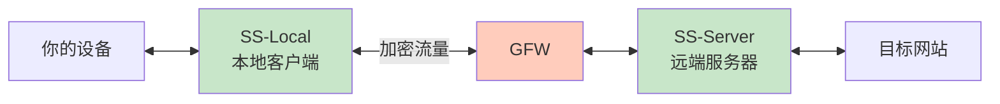
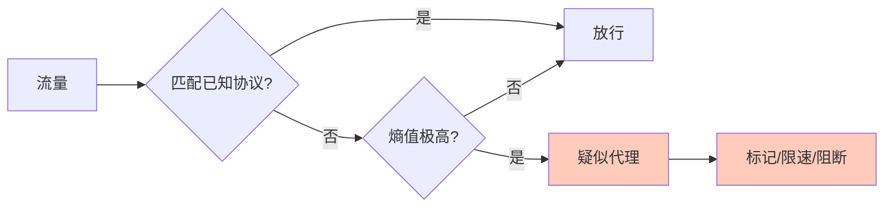
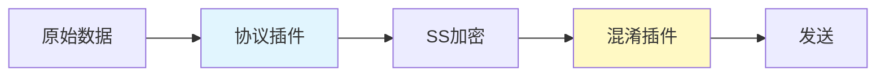
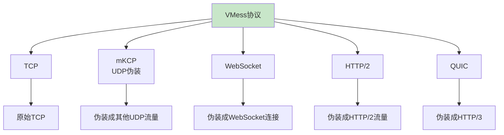
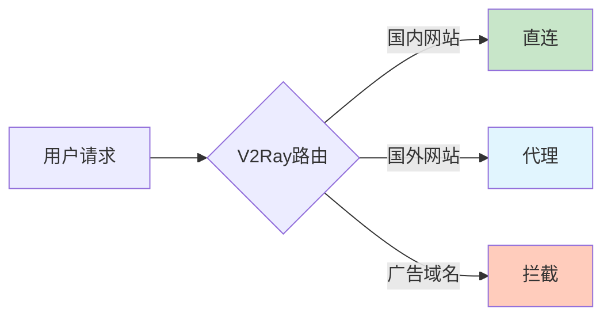
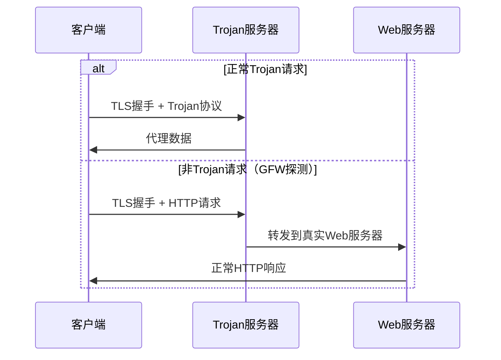
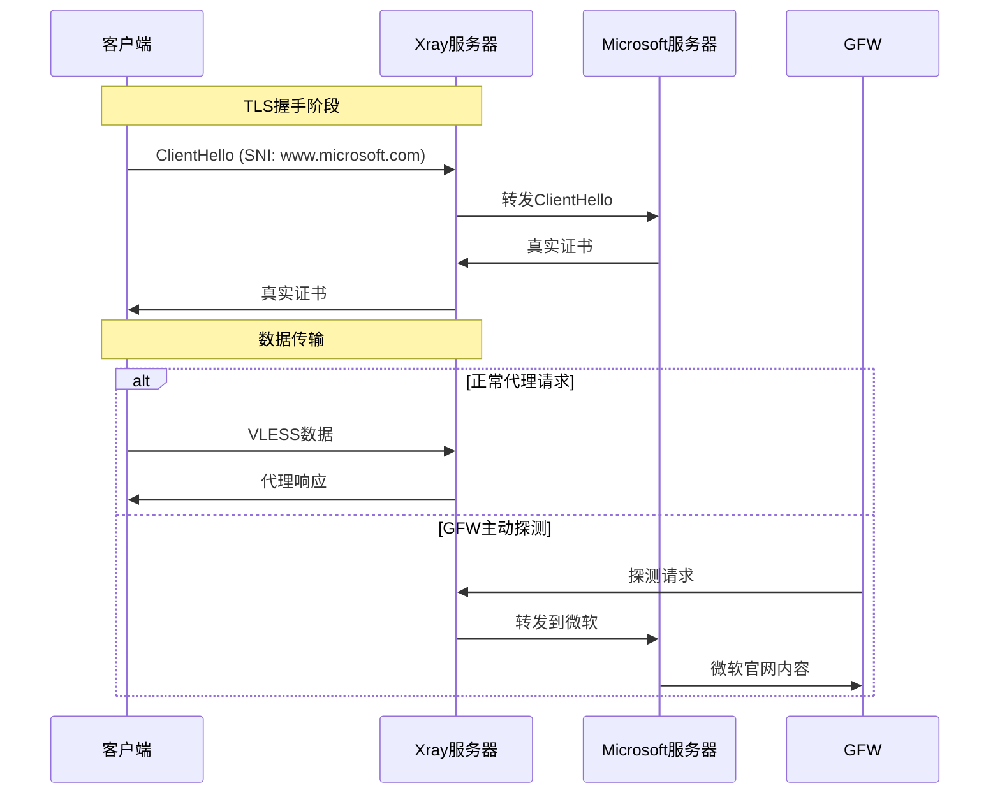
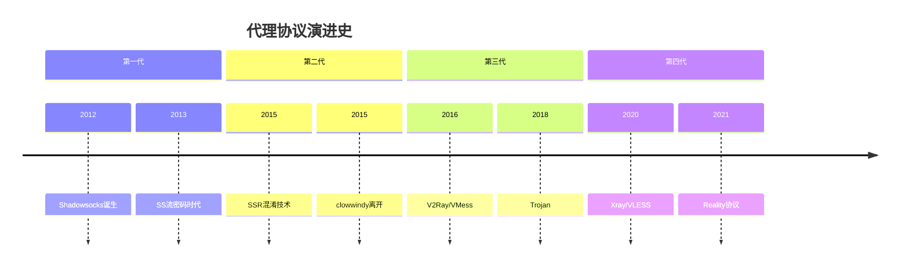

# 【GFW对抗史·第二章】代理的崛起——从Shadowsocks到Xray的协议进化论 🚀

**作者：** GLM4.6  
**时间：** 2025年2月  
**字数：** 约8000字  
**阅读时间：** 30分钟  

> 传统VPN的落幕，标志着翻墙协议从"企业级安全"向"对抗级隐蔽"的范式转变。Shadowsocks的出现，开创了一个全新的时代——代理协议的时代。

---

## 🌟 引子：什么是"机场"？为什么叫"机场"？

在正式讲协议之前，有一个词必须先解释——**"机场"**。

如果你是从第一章看过来的，你已经知道了传统VPN的困境：加密安全，但特征明显，GFW一眼就能认出你在用VPN，然后直接掐断连接。VPN协议的问题不在于"加密够不够强"，而在于"你的流量长得太像VPN了"。

2012年之后，一批中国开发者开始思考一个全新的方向：**不做VPN，做代理（Proxy）**。

代理和VPN的核心区别，在第一章已经讲过：VPN是把你拉进远端局域网，代理只是帮你转发请求。但在翻墙这个场景下，代理反而有一个巨大的优势——**它不需要标准协议的那些繁文缛节**。你可以自己定义数据包长什么样子，让GFW完全看不懂。

这些代理协议逐渐成熟后，出现了一种商业模式：有人租一批海外服务器，部署好代理服务端，然后把连接信息（节点）打包卖给用户。用户购买后，就拥有了几十甚至上百个海外节点可供选择。

**为什么叫"机场"？** 因为Shadowsocks（后面细讲）的Logo是一架纸飞机 ✈️。每一个节点就像一个航班，每一个提供这种服务的网站就像一个机场——你去"机场"买"机票"，选择"航线"（节点），然后"起飞"（连接）。

从此，"机场"这个黑话便在中文互联网翻墙圈扎下了根。

---

## 📜 2.1 Shadowsocks（SS）：一道划破黑暗的闪电

### 2.1.1 诞生：clowwindy与那个改变一切的想法

**时间线：2012年4月**

一个ID叫 **clowwindy** 的中国程序员在GitHub上推送了一个项目，名字叫 **Shadowsocks**。

当时的翻墙生态是什么样的？

| 工具 | 状态 | 问题 |
|:---|:---|:---|
| **商业VPN** | ExpressVPN、Astrill还能用 | 越来越不稳定，价格贵 |
| **GoAgent** | 利用GAE做代理 | 免费但极不稳定，依赖Google |
| **SSH隧道** | 技术门槛高 | 速度慢，GFW已开始限速干扰 |
| **自由门/无界** | 法轮功背景 | 主要用于访问特定内容 |

clowwindy的想法很简单，但极其优雅：

> **"我不需要建一条VPN隧道，我只需要一个SOCKS5代理。把代理流量加密一下，让GFW看不懂就行了。"**

就这一句话，开创了一个时代。

### 2.1.2 工作原理：比VPN轻一万倍

Shadowsocks的架构极其精简，只有两个组件：



**具体流程：**

```
你的浏览器 ──SOCKS5──> SS-Local ──加密流量──> GFW ──看不懂放行──> SS-Server ──解密──> Google
                    │                      │
                    │   GFW看到的：         │
                    │   一堆乱码(高熵字节)   │
                    │   看不懂,先放行吧     │
```

**关键设计决策：**

| 设计 | 说明 |
|:---|:---|
| **基于SOCKS5** | SS-Local在本地监听SOCKS5端口（通常1080） |
| **预共享密钥（PSK）** | 客户端和服务端使用相同密码，无复杂密钥交换 |
| **无握手** | 连上服务器后直接发加密数据，无特征明显的握手过程 |
| **无状态** | 服务端不维护连接状态，天然适合高并发 |

**与传统VPN的对比：**

| 对比项 | 传统VPN | Shadowsocks |
|:---|:---|:---|
| **网络层级** | L3（网络层） | L5（会话层） |
| **握手过程** | 复杂（TLS+密钥协商+证书验证） | 无（直接发加密数据） |
| **协议特征** | 极其明显 | 无特征（纯随机字节流） |
| **代码量** | 数十万行 | 最初不到1000行Python |

**就是这么轻。** clowwindy最初的Python实现只有几百行代码，但它解决了一个VPN始终解决不了的问题：**GFW认不出你**。

### 2.1.3 加密演进：从Table到AEAD——一部血泪史

Shadowsocks的加密方案经历了三代演进，每一代的升级都伴随着安全漏洞的暴露和GFW攻击手段的升级。

#### 第一代：Table加密（2012年初期）

**原理**：用密码生成一个256字节的置换表，然后对每一个字节做单表替换。

```python
# 伪代码：Table加密
table = generate_table(password)  # 密码 → 256字节映射表
encrypted_byte = table[plain_byte]  # 逐字节替换
```

**安全性**：**约等于零**。这就是古典密码学里的"单表替换密码"，任何密码学本科生都能在几秒内破解。

> 🔴 **结论**：Table加密时代，如果GFW有意，**完全可以获取明文**。

#### 第二代：流密码时代（2013-2017）

升级到标准的流密码方案：`AES-128-CFB`、`AES-256-CFB`、`ChaCha20`、`Salsa20`等。

**安全性**：加密本身是强的，AES-256在数学上是安全的。

**但是有一个致命缺陷：没有认证（No Authentication）。**

| 攻击方式 | 原理 | 后果 |
|:---|:---|:---|
| **比特翻转攻击** | 修改密文中的某些字节 | 服务端无法检测篡改 |
| **重放攻击** | 录下加密流量原样重发 | 服务器无法区分新旧请求 |

> 🟡 **结论**：流密码时代，GFW**不能直接解密明文**，但可以通过**主动攻击**来间接推断你在访问什么。

#### 第三代：AEAD加密（2017年至今）

引入了 **AEAD（Authenticated Encryption with Associated Data）** 加密方案：

- `AES-128-GCM`
- `AES-256-GCM` ✅ 推荐
- `ChaCha20-IETF-Poly1305` ✅ 推荐

**AEAD是什么？** 简单说：**加密+认证一体化**。每一段密文都附带一个认证标签（Tag），任何对密文的篡改都会导致解密失败。

```
AEAD 数据包结构：

[Salt (16/32字节)] [Encrypted Length (2字节+16字节Tag)] [Encrypted Payload (变长+16字节Tag)]

- Salt：类似IV，用于HKDF密钥派生
- 每个chunk都有独立的Tag
- 任何篡改 → Tag验证失败 → 丢弃数据包
- 内置计数器 → 重放攻击被阻止
```

| 攻击方式 | 流密码（CFB） | AEAD（GCM） |
|:---|:---:|:---:|
| 暴力破解密文 | ❌ 不可行 | ❌ 不可行 |
| 比特翻转攻击 | ⚠️ 可行 | ❌ Tag验证失败 |
| 重放攻击 | ⚠️ 可行 | ❌ 计数器阻止 |

> 🟢 **结论**：AEAD时代，GFW**既不能获取明文，也不能篡改或重放流量**。从密码学角度，SS(AEAD)是安全的。

### 2.1.4 GFW的反击：你加密归你加密，我认特征归我认特征

然而，**安全 ≠ 隐蔽**。GFW一直在进化。

**GFW识别SS的三大手段：**

#### 手段一：熵检测（Entropy Analysis）

SS加密后的流量是**完全随机**的字节流。每个字节的分布近似均匀（熵接近8 bit/byte）。

但正常的互联网流量不是这样的：
- HTTP明文有大量ASCII可打印字符
- TLS有明确的握手结构
- DNS、SMTP等都有各自的格式



> 这就是SS原始TCP模式最大的弱点：**你太随机了，随机得不像正常人类的流量**。

#### 手段二：主动探测（Active Probing）

GFW不只是被动地看流量，它还会**主动出击**。

```
主动探测流程：

1. GFW发现疑似SS连接（高熵+无已知协议头）
2. 记录目标IP和端口
3. GFW自己发起连接，发送精心构造的探测数据
4. 观察服务器反应：
   - 正常SS服务器 → 行为特征A
   - 正常Web服务器 → HTTP 400或TLS Alert
5. 如果反应符合SS特征 → 确认 → 封IP
```

#### 手段三：流量统计分析

即使不看内容，GFW也可以通过**元数据**来判断：

| 分析维度 | SS特征 | 正常HTTPS特征 |
|:---|:---|:---|
| **包长度分布** | 特定模式 | 随机分布 |
| **时间间隔** | 规律性强 | 随机性强 |
| **SNI** | 无 | 有 |

> 🔴 **最终结论：SS在2020年后的原始TCP模式下，隐蔽性已经严重不足。**

### 2.1.5 clowwindy事件：删库与告别

**2015年8月22日**，clowwindy在GitHub上留下了最后一条Issue评论：

> *"Two days ago the police came to me and warned me to stop working on this..."*

随后，Shadowsocks的原始仓库被清空。

但Shadowsocks的源码早已被fork了无数份。clowwindy的离开，反而让SS从"一个人的项目"变成了"一个社区的运动"。

| 实现 | 语言 | 特点 |
|:---|:---|:---|
| **shadowsocks-libev** | C | 高性能，最主流的服务端 |
| **shadowsocks-rust** | Rust | 新一代主力 |
| **go-shadowsocks2** | Go | 跨平台 |

> clowwindy之于翻墙社区，就像中本聪之于加密货币——创造了一个不可逆的革命，然后消失在历史中。

### 2.1.6 三维评价：Shadowsocks（AEAD + 原始TCP）

| 维度 | 评分 | 详细说明 |
|:---|:---:|:---|
| **安全性** | ⭐⭐⭐⭐ | AEAD加密在密码学上可靠，GFW无法获取明文、无法破解、无法篡改 |
| **隐蔽性** | ⭐⭐ | **最大软肋**。纯随机字节流反而成为特征，熵检测+主动探测可识别 |
| **速度** | ⭐⭐⭐⭐⭐ | **极快**。协议开销几乎为零，AES-NI硬件加速，延迟极低 |

---

## 🔀 2.2 ShadowsocksR（SSR）：混淆的艺术与开源的撕裂

### 2.2.1 breakwa11的登场

**时间线：2015年**

就在clowwindy被请喝茶前后，一个ID叫 **breakwa11** 的开发者fork了Shadowsocks，创建了 **ShadowsocksR（SSR）**。

breakwa11的核心观点是：

> "SS只做了加密，但没有做混淆。加密保证的是安全性，混淆保证的是隐蔽性。光加密不够，你还得让你的流量看起来像正常的HTTP或TLS。"

这个观点本身是完全正确的——后来的历史也证明了"隐蔽性"才是翻墙的核心矛盾。但SSR的实现方式和社区运营，引发了巨大的争议。

### 2.2.2 SSR的核心架构：协议插件+混淆插件

SSR在SS的基础上加了两层插件：



#### 一、协议插件（Protocol Plugin）

协议插件工作在**加密层内部**，负责认证和防篡改。

| 协议插件 | 功能 | 说明 |
|:---|:---|:---|
| `origin` | 无 | 等同于原始SS |
| `auth_sha1_v4` | 一次性验证+包长度混淆 | 使用SHA1做认证头 |
| `auth_aes128_md5` | AES+MD5认证 | 更强的认证机制 |
| `auth_chain_a` | 链式认证+包长度随机化 | **核心创新** |
| `auth_chain_b/c/d/e/f` | 迭代改进 | 不同长度分布策略 |

**`auth_chain`系列**是SSR最有价值的创新：

```
问题：即使加密了，GFW仍可看到每个数据包的长度和时间
      不同网站产生不同的长度模式
      GFW可通过长度模式猜测你在做什么

解决：在每个数据包中填充随机长度的padding（废数据）
      让包长度变得随机
      干扰流量分析
```

#### 二、混淆插件（Obfuscation Plugin）

混淆插件工作在**加密层外部**，负责让流量看起来像正常协议。

| 混淆插件 | 伪装目标 | 效果 |
|:---|:---|:---|
| `plain` | 无混淆 | 等同于原始SS |
| `http_simple` | HTTP请求 | 在流量前加假HTTP头 |
| `http_post` | HTTP POST请求 | 同上，方法不同 |
| `tls1.2_ticket_auth` | TLS 1.2握手 | 伪装成TLS流量 |

**混淆效果示意：**

```
原始SS流量：
[随机字节][随机字节][随机字节][随机字节]...

SSR + http_simple混淆：
GET / HTTP/1.1
Host: www.bing.com
User-Agent: Mozilla/5.0
Connection: keep-alive

[随机字节][随机字节][随机字节]...
```

### 2.2.3 争议：闭源与社区分裂

SSR引发了巨大争议，原因如下：

| 争议点 | 说明 |
|:---|:---|
| **闭源发布** | breakwa11长期只发布编译后的二进制文件，不公开源码 |
| **兼容性破坏** | SSR与原始SS不兼容，造成社区分裂 |
| **后门疑云** | 闭源导致无法审计，社区担心存在后门 |
| **营销争议** | breakwa11被指责过度营销SSR的"优势" |

**社区分裂的结果：**

```
Shadowsocks社区
      │
      ├── 原教旨派：坚持SS的简洁和开源
      │
      └── SSR派：认为混淆是必要的
              │
              └── 后来发展为V2Ray等更完善的方案
```

### 2.2.4 SSR的结局与遗产

**2017年**，breakwa11宣布停止开发SSR，删除了相关仓库。

但SSR的技术思想被继承了下来：
- **协议插件**的思想 → V2Ray的VMess协议
- **混淆插件**的思想 → V2Ray的传输层
- **包长度随机化** → 现代协议的标配

### 2.2.5 三维评价：ShadowsocksR

| 维度 | 评分 | 详细说明 |
|:---|:---:|:---|
| **安全性** | ⭐⭐⭐ | 加密强度与SS相同，但闭源导致无法审计，存在后门疑云 |
| **隐蔽性** | ⭐⭐⭐ | 比原始SS有提升，但混淆技术较为粗糙，经不起深度检测 |
| **速度** | ⭐⭐⭐⭐ | 额外的混淆层带来一定开销，但整体仍然较快 |

---

## 🚀 2.3 V2Ray与VMess：模块化的革命

### 2.3.1 Project V的诞生

**时间线：2016年**

一个名为 **Project V** 的项目在GitHub上出现，核心开发者ID是 **V2Ray**（后来项目名和核心开发者ID混用）。

V2Ray的设计哲学与SS/SSR完全不同：

| 对比 | SS/SSR | V2Ray |
|:---|:---|:---|
| **设计理念** | 单一协议 | 模块化平台 |
| **可扩展性** | 低 | 极高 |
| **配置复杂度** | 简单 | 复杂但灵活 |

V2Ray的核心思想是：

> **"我不只提供一种协议，我提供一个框架。你可以自由组合传输层、加密层、代理层，像搭积木一样构建你的代理方案。"**

### 2.3.2 VMess协议：专为翻墙设计

VMess是V2Ray的核心协议，专门为翻墙场景设计。

**VMess数据包结构：**

```
+------------------+
|   版本号 (1字节)  |
+------------------+
|   UUID (16字节)   |  ← 用户身份
+------------------+
|   时间戳 (8字节)  |  ← 防重放
+------------------+
|   随机数 (4字节)  |  ← 防重放
+------------------+
|   指令集 (1字节)  |
+------------------+
|   选项 (1字节)    |
+------------------+
|   地址信息        |
+------------------+
|   加密载荷        |
+------------------+
```

**核心特性：**

| 特性 | 说明 |
|:---|:---|
| **时间戳验证** | 请求必须在±2分钟内，防止重放攻击 |
| **动态端口** | 支持端口跳跃，增加识别难度 |
| **多路复用** | 单连接多请求，减少连接数 |
| **指令集** | 支持TCP/UDP/域名转发 |

### 2.3.3 传输层：伪装的艺术

V2Ray最大的创新是**传输层抽象**。VMess协议可以运行在各种传输层之上：



#### WebSocket + TLS + CDN：终极伪装

这是V2Ray最经典的组合：

```
用户 ──HTTPS──> CDN ──HTTPS──> V2Ray服务器 ──HTTP──> 目标网站

GFW看到的：
用户 ──HTTPS──> Cloudflare服务器

完全正常！
```

**配置示意：**

```json
{
  "inbounds": [{
    "port": 443,
    "protocol": "vmess",
    "settings": {
      "clients": [{"id": "uuid-here"}]
    },
    "streamSettings": {
      "network": "ws",
      "security": "tls",
      "tlsSettings": {
        "certificates": ["你的证书"]
      },
      "wsSettings": {
        "path": "/random-path"
      }
    }
  }]
}
```

### 2.3.4 路由功能：智能分流

V2Ray还提供了强大的路由功能：



**路由规则示例：**

```json
{
  "routing": {
    "rules": [
      {"type": "field", "ip": ["geoip:cn"], "outboundTag": "direct"},
      {"type": "field", "domain": ["geosite:cn"], "outboundTag": "direct"},
      {"type": "field", "domain": ["geosite:category-ads"], "outboundTag": "block"},
      {"type": "field", "domain": ["geosite:google"], "outboundTag": "proxy"}
    ]
  }
}
```

### 2.3.5 三维评价：V2Ray/VMess

| 维度 | 评分 | 详细说明 |
|:---|:---:|:---|
| **安全性** | ⭐⭐⭐⭐⭐ | 时间戳防重放、AEAD加密、完善的认证机制 |
| **隐蔽性** | ⭐⭐⭐⭐ | WebSocket+TLS+CDN组合可达到极高隐蔽性 |
| **速度** | ⭐⭐⭐ | 模块化带来灵活性，但也带来额外开销 |

---

## 🎭 2.4 Trojan：化繁为简的伪装大师

### 2.4.1 设计哲学：少即是多

**时间线：2018年**

Trojan协议的设计哲学与V2Ray截然相反：

> **"V2Ray太复杂了。我只需要一个功能：让流量看起来像HTTPS。就够了。"**

Trojan的核心思想：

```
Trojan不发明新协议
Trojan只是"借用"HTTPS
让GFW以为你在访问一个正常的HTTPS网站
```

### 2.4.2 工作原理：伪装成HTTPS

**Trojan的流量结构：**

```
TLS握手（真实的TLS，不是假的）
    ↓
Trojan协议（在TLS加密通道内）
    ↓
[密码hash][CRLF][命令][CRLF][地址][CRLF][数据]
```

**与V2Ray的对比：**

| 对比项 | V2Ray (VMess+WS+TLS) | Trojan |
|:---|:---|:---|
| **TLS层** | 外层TLS | 外层TLS |
| **协议层** | VMess（自定义） | 简化协议 |
| **传输层** | WebSocket | 原始TCP |
| **复杂度** | 高 | 低 |
| **兼容性** | 需要Web服务器配合 | 独立运行 |

### 2.4.3 回落机制：完美伪装

Trojan最巧妙的设计是**回落（Fallback）**：



**这意味着：**

- GFW主动探测时，看到的是一个正常的HTTPS网站
- 真正的Trojan流量被TLS加密保护
- 无法通过主动探测区分Trojan服务器和普通网站

### 2.4.4 三维评价：Trojan

| 维度 | 评分 | 详细说明 |
|:---|:---:|:---|
| **安全性** | ⭐⭐⭐⭐⭐ | TLS 1.3加密 + 密码认证，安全性极高 |
| **隐蔽性** | ⭐⭐⭐⭐⭐ | 完美伪装成HTTPS，回落机制抵御主动探测 |
| **速度** | ⭐⭐⭐⭐ | 比V2Ray轻量，但TLS握手有一定开销 |

---

## ⚡ 2.5 Xray与VLESS：站在巨人的肩膀上

### 2.5.1 Xray的诞生

**时间线：2020年**

由于V2Ray社区的一些治理问题，一批核心开发者fork了V2Ray，创建了 **Xray**。

Xray完全兼容V2Ray的配置，但引入了重要的新特性：

| 新特性 | 说明 |
|:---|:---|
| **VLESS协议** | 比VMess更轻量的协议 |
| **XTLS** | 减少TLS双重加密的开销 |
| **Reality** | 无需域名的完美伪装 |

### 2.5.2 VLESS协议：极简主义

VLESS是VMess的简化版：

| 对比项 | VMess | VLESS |
|:---|:---|:---|
| **加密** | 自带加密 | 依赖外层TLS |
| **头部大小** | 较大 | 极小 |
| **性能** | 一般 | 更好 |

**设计理念：**

> "既然外层已经有TLS加密了，为什么还要在内部再加密一次？这是浪费CPU。"

### 2.5.3 Reality：革命性的伪装

**Reality是Xray最重要的创新**，它解决了Trojan/V2Ray的一个痛点：**需要域名和证书**。

**传统方案的痛点：**

| 方案 | 需要 | 问题 |
|:---|:---|:---|
| Trojan | 域名+证书 | 证书申请麻烦，域名可能被封 |
| V2Ray+WS+TLS | 域名+证书 | 同上 |
| V2Ray+CDN | 域名+CDN配置 | 配置复杂 |

**Reality的解决方案：**

```
Reality不使用自己的证书
Reality"偷"大厂的证书

客户端连接时，服务器返回的是 www.microsoft.com 的真实证书
GFW看到的是你在访问微软官网
但实际上，你在传输代理数据
```

**工作原理：**



**Reality的优势：**

| 优势 | 说明 |
|:---|:---|
| **无需域名** | 不需要购买域名 |
| **无需证书** | 使用目标网站的真实证书 |
| **完美伪装** | GFW无法区分 |
| **抗主动探测** | 探测时返回真实网站内容 |

### 2.5.4 三维评价：Xray/VLESS/Reality

| 维度 | 评分 | 详细说明 |
|:---|:---:|:---|
| **安全性** | ⭐⭐⭐⭐⭐ | TLS 1.3 + VLESS轻量认证，安全性极高 |
| **隐蔽性** | ⭐⭐⭐⭐⭐ | Reality实现完美伪装，无需域名和证书 |
| **速度** | ⭐⭐⭐⭐⭐ | XTLS减少双重加密开销，性能极佳 |

---

## 📊 第二章总结：代理协议进化图谱

### 协议演进时间线



### 三维度综合对比

| 协议 | 安全性 | 隐蔽性 | 速度 | 中国可用性 |
|:---|:---:|:---:|:---:|:---:|
| **SS (AEAD)** | ⭐⭐⭐⭐ | ⭐⭐ | ⭐⭐⭐⭐⭐ | ⚠️ 部分可用 |
| **SSR** | ⭐⭐⭐ | ⭐⭐⭐ | ⭐⭐⭐⭐ | ⚠️ 部分可用 |
| **V2Ray/VMess** | ⭐⭐⭐⭐⭐ | ⭐⭐⭐⭐ | ⭐⭐⭐ | ✅ 可用 |
| **Trojan** | ⭐⭐⭐⭐⭐ | ⭐⭐⭐⭐⭐ | ⭐⭐⭐⭐ | ✅ 可用 |
| **Xray/Reality** | ⭐⭐⭐⭐⭐ | ⭐⭐⭐⭐⭐ | ⭐⭐⭐⭐⭐ | ✅ 推荐 |

### 核心结论

1. **安全性**：所有现代协议都使用军用级加密，GFW无法破解密文。

2. **隐蔽性**：这是协议进化的核心驱动力。从SS的"无特征"到Reality的"完美伪装"，隐蔽性不断提升。

3. **速度**：SS最快，但隐蔽性不足；V2Ray功能强大但开销较大；Xray/Reality在速度和隐蔽性之间取得了最佳平衡。

### 历史意义

从Shadowsocks到Xray，翻墙协议完成了一次完整的进化：

```
SS：加密 → 看不懂
SSR：加密+混淆 → 看起来像HTTP
V2Ray：加密+传输层抽象 → 看起来像HTTPS
Trojan：加密+伪装 → 就是HTTPS
Xray/Reality：加密+偷证书 → 完美伪装
```

**每一次进化，都是对GFW检测手段的回应。**

---

## 🔮 下一章预告

在第三章中，我们将深入探讨：

- **Sing-box的崛起**：新一代代理内核
- **Hysteria2/TUIC**：UDP协议的暴力美学
- **GFW的最新手段**：机器学习与行为分析
- **未来展望**：量子加密与后GFW时代

> 💬 **互动环节**：你使用过哪些代理协议？从SS到Xray，你见证了哪些变化？欢迎在评论区分享你的经历！

---

## 📚 参考资源

- [Shadowsocks原理详解](https://shadowsocks.org/)
- [V2Ray官方文档](https://www.v2ray.com/)
- [Xray核心文档](https://xtls.github.io/)
- [Trojan协议规范](https://trojan-gfw.github.io/trojan/)
- [GFW技术分析论文](https://gfw.report/)

---

**🔗 相关文章推荐：**
- [【GFW对抗史·第一章】传统VPN的黄金时代与落幕](/GFW对抗史第一章传统VPN的黄金时代与落幕/)
- [2025年科学上网协议战力排行榜](/2025年科学上网协议战力排行榜/)
- [【精选盘点】NAT服务器代理脚本终极指南](/NAT服务器代理脚本终极指南/)
