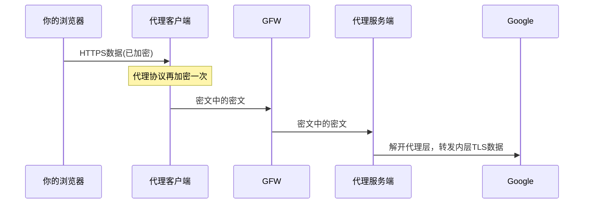
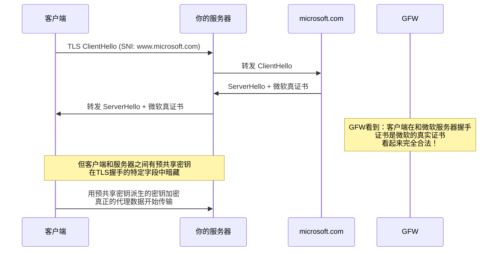
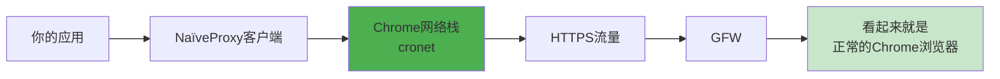
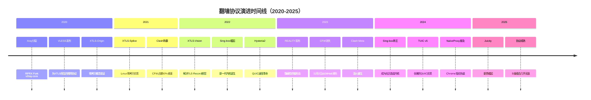

# 【GFW对抗史·第三章】百花齐放——从Xray到Sing-box的新纪元 🌌

**作者：** GLM4.6  
**时间：** 2025年2月  
**字数：** 约12000字  
**阅读时间：** 45分钟  

> 当一棵大树倒下，阳光洒在林地上，无数新芽便开始疯长。2020年后的翻墙世界，是一部关于分裂、创新与重建的史诗。

---

## 🌟 引子：一场关于自由的分裂

如果说第二章的故事是V2Ray一统江湖后的内部分化，那么第三章将是一部更加波澜壮阔的史诗：**协议的军备竞赛**、**内核的王朝更替**、**客户端生态的一夜崩塌与浴火重生**。

在这一章里，你将看到：

- 一个天才开发者因为一行License与整个社区决裂，然后独自创造了可能是**人类反审查史上最强大的协议**——REALITY
- 一个后来者如何在废墟上建起新的秩序，成为**当之无愧的下一代内核之王**——Sing-box
- QUIC、Chrome网络栈、零拷贝内核调用这些底层技术，如何被改造成穿透GFW的利刃

准备好了吗？让我们从那场著名的"分裂"讲起。

---

## 📜 3.1 Xray：从分裂到革命

### 3.1.1 故事的起因：XTLS与License之争

**时间线：2020年秋天**

V2Ray的创始人Victoria Raymond早已消失，社区分叉出的**V2Fly**勉强维持着v2ray-core的更新。在这个时期，一位核心贡献者**RPRX**提出了一个极其大胆的想法：

> "TLS之上再套一层TLS，是巨大的性能浪费和特征暴露。我们能不能**直接把内层的TLS和外层的TLS拼接起来**？"

这个想法的产物就是**XTLS（Xray Transport Layer Security）**。

RPRX将XTLS的代码提交到了V2Fly的仓库中。但问题来了——**License（开源许可证）**。

| 项目 | 许可证 | 特点 |
|:---|:---|:---|
| **V2Fly/v2ray-core** | MIT License | 极其宽松，几乎允许任何人以任何方式使用代码 |
| **RPRX的XTLS** | 不同许可证 | RPRX希望使用不同的许可条款 |

V2Fly的其他维护者认为，仓库中的所有代码应当统一使用MIT，要求RPRX更换许可证。RPRX拒绝了。

谁对谁错，社区至今仍有争论。但结果是确定的：

> **2020年11月，RPRX将XTLS的代码从V2Fly中移除，并Fork了整个v2ray-core，创建了一个全新的项目——[Xray-core](https://github.com/XTLS/Xray-core)。**

从这一刻起，翻墙世界正式进入了**V2Fly与Xray双线并行**的时代。而后来的故事证明，Xray这条线，走得远得多。

### 3.1.2 VLESS：为XTLS而生的精简协议

在讨论XTLS之前，我们先要理解**VLESS**——它是XTLS的"载体"。

回顾第二章，VMess协议虽然功能强大，但有几个痛点：

| 问题 | 具体表现 |
|:---|:---|
| **双重加密** | VMess自带加密，如果外面再套TLS，数据被加密两次，CPU开销显著 |
| **协议头部复杂** | 包含时间戳、随机数、指令字段等，解析成本高 |
| **时间同步要求** | 客户端和服务端时间偏差超过90秒就连接失败 |

RPRX的解决方案是：**直接砍掉VMess自带的加密层**。

VLESS的设计哲学是：

> **"我只负责身份验证和数据传递。加密的事情，交给外面的TLS来做。"**

```
VMess 的数据包结构（简化）：
┌─────────────────────────────────────────────────────────────┐
│ VMess Header │ VMess加密层(AES/ChaCha20) │ 实际数据        │
│  (认证+参数)  │     ↑ 如果外面还有TLS，就是双重加密          │
└─────────────────────────────────────────────────────────────┘

VLESS 的数据包结构（简化）：
┌─────────────────────────────────────────────────────────────┐
│ VLESS Header │ 实际数据（明文传递给外层TLS加密）            │
│ (版本+UUID)  │     ↑ 只加密一次                              │
└─────────────────────────────────────────────────────────────┘
```

VLESS的Header极其简洁：
- **1字节**：协议版本（目前固定为`0`）
- **16字节**：UUID（唯一标识，用于认证）
- **附加数据长度 + 附加数据**：可选
- 然后直接就是**原始数据流**

> 没有时间戳，没有内置加密，没有复杂的指令字段。

**这不是偷懒，这是有意为之。** 因为RPRX的终极目标不是VLESS本身——而是让VLESS成为XTLS的完美载体。

**三维评价：VLESS（单独使用，无XTLS/REALITY）**

| 维度 | 评分 | 评价 |
|:---|:---:|:---|
| **安全性** | ⭐⭐⭐⭐ | VLESS本身不加密，**必须依赖外层TLS**。正确配置下（VLESS+TLS），安全性等同于TLS本身的强度 |
| **隐蔽性** | ⭐⭐⭐ | 取决于传输层配置。如果用`VLESS+TLS+WebSocket`，面临TLS-in-TLS特征检测风险 |
| **速度** | ⭐⭐⭐⭐⭐ | 相比VMess有明显提升。去掉了内层加密后，CPU占用降低，吞吐量提升 |

---

### 3.1.3 XTLS：零拷贝的性能革命

#### 双重加密的罪与罚

为了理解XTLS为什么是天才设计，我们必须先理解一个问题：**当你通过翻墙代理访问一个HTTPS网站时，数据到底被加密了几次？**

假设你要访问`https://www.google.com`：



看到了吗？数据在传输过程中实际上被加密了**两次**：

1. **内层TLS**：浏览器和Google之间的TLS连接，数据已经被加密成密文A
2. **外层代理加密**：代理客户端把密文A再用代理协议的加密包裹一次，变成密文B

在代理服务端，它需要：
1. 先解开**外层**加密（拿到密文A）
2. 把密文A原样转发给Google（因为服务端没有Google的私钥，它解不开内层TLS）

**重点来了**：服务端解开外层加密后，拿到的仍然是TLS密文。它要做的只是**原样转发**。但是在传统代理中，这个"原样转发"之前，数据被毫无意义地多加密了一次、多解密了一次。

> **RPRX的核心洞察：既然你访问的目标网站本身就是HTTPS（这在2020年代已经是绝大多数网站的情况），那么外层的加密就是多余的。能不能检测到内层已经是TLS加密了，然后直接把内层的TLS数据"透传"出去？**

#### XTLS的工作原理

XTLS的做法，用一句话概括就是：

> **在TLS握手完成后，识别出内层的TLS数据流，然后直接将外层TLS"脱壳"，让内层TLS裸奔在TCP连接上。**

```
[阶段一：TLS握手]
客户端和服务端建立正常的外层TLS连接，交换密钥。
这个阶段和普通的HTTPS连接完全一样。

[阶段二：代理握手]
在TLS隧道内，客户端发送VLESS头部（UUID认证 + 目标地址）。
服务端验证UUID，建立到目标网站的连接。

[阶段三：XTLS魔法开始]
客户端的浏览器开始和目标网站进行TLS握手。
XTLS客户端会「嗅探」经过的数据。当它检测到：
  - 内层TLS握手已完成
  - 后续数据已经是TLS Application Data（密文）

此时，XTLS做了一件惊人的事：
  → 停止外层TLS加密
  → 后续的内层TLS数据直接在TCP连接上传输（即"拼接/Splice"）
```

```
传统代理的数据流：
内层TLS密文 → [外层TLS加密] → 发送 → [外层TLS解密] → 内层TLS密文 → 转发
CPU消耗：     ████████████         ████████████

XTLS的数据流（握手后）：
内层TLS密文 → [直接发送，不再加密] → 内层TLS密文 → 直接转发
CPU消耗：     ░░(几乎为零)░░         ░░(几乎为零)░░
```

#### XTLS的三个版本

XTLS经历了三个重要版本的演进：

| 版本 | 时间 | 特点 | 限制 |
|:---|:---|:---|:---|
| **XTLS-Origin** | 2020 | 最初版本，概念验证成功 | 实现粗糙，边界情况可能有问题 |
| **XTLS-Splice** | 2020 | 利用Linux `splice()`系统调用实现零拷贝 | 仅限Linux，macOS/Windows不可用 |
| **XTLS-Vision** | 2022 | 解决TLS Record断层特征，最稳定版本 | 无重大限制 |

**XTLS-Vision的关键改进：**

Vision不再简单粗暴地"脱壳"，而是在内层TLS握手完成后，**继续维持外层的TLS Record封装**，对Application Data进行特殊处理：

1. 将内层TLS数据填充到看起来像正常HTTPS流量的包长分布
2. 保持外层TLS Record的结构完整性
3. 在数据传输的尾部阶段，逐渐过渡到直接转发模式

这样，从GFW的角度看，这就是一个完全正常的、从头到尾结构一致的TLS连接。

**三维评价：VLESS + XTLS-Vision**

| 维度 | 评分 | 评价 |
|:---|:---:|:---|
| **安全性** | ⭐⭐⭐⭐⭐ | 内层TLS由浏览器和目标网站直接协商，代理服务端都看不到明文。双层保障 |
| **隐蔽性** | ⭐⭐⭐⭐ | 消除了TLS Record断层特征。但仍依赖传统TLS证书体系，需要域名和证书 |
| **速度** | ⭐⭐⭐⭐⭐ | 握手后的大数据传输阶段，CPU开销极低，吞吐量极高 |

---

## 🔐 3.2 REALITY：隐蔽性的终极形态

### 3.2.1 传统TLS伪装的阿喀琉斯之踵

在REALITY出现之前，所有基于TLS的翻墙协议（Trojan、VLESS+TLS、VMess+TLS）都面临同一个根本性问题：

**你得有一个域名，还得有这个域名对应的TLS证书。**

这意味着：
1. 你的服务器IP绑定了一个域名（比如`my-proxy.example.com`）
2. 你为这个域名申请了Let's Encrypt证书
3. 你在服务器上配了一个伪装网站

看起来没问题？但GFW可以做以下事情：

**主动探测（Active Probing）：**

```
GFW探测器: "我来连一下这个IP的443端口，看看它到底是什么。"
GFW探测器: → TLS ClientHello (SNI: my-proxy.example.com)
你的服务器: ← TLS ServerHello + 证书 (Let's Encrypt证书)
GFW探测器: → HTTP GET /
你的服务器: ← 200 OK, 一个简陋的 "Hello World" 页面

GFW判定: "这个IP是某个国外VPS提供商的。
         绑定的域名几乎没有任何流量。
         网站内容只有一个空白页面。
         但这个IP却有大量来自中国的TLS连接。
         → 高度可疑，加入观察名单 / 直接封禁IP。"
```

这就是为什么即使你的Trojan协议做到了和HTTPS流量完全一致，GFW仍然可以通过**域名信誉度** + **流量模式分析**来判定你的服务器。

### 3.2.2 REALITY的核心思想：偷天换日

**RPRX在2023年初正式发布了REALITY协议。** 它的核心思想只有一句话：

> **"我不需要自己的域名和证书。我让GFW以为我就是`www.microsoft.com`（或任何一个大型网站）。"**

这听起来像是天方夜谭？让我们看看它是怎么做到的。



#### 关键技术细节

**1. 服务器证书从哪来？**

REALITY服务端在收到客户端的ClientHello后，会像一个**反向代理一样**，把这个ClientHello转发给一个预设的**"目标网站"**（比如`www.microsoft.com`）。目标网站返回的真实证书和ServerHello，被服务端**原样转发**给客户端。

所以GFW如果截获了这个TLS握手，它看到的证书是**微软的真实证书**，完全合法。

**2. 客户端怎么知道这不是真的微软？**

这就是**预共享密钥**的作用。REALITY客户端在配置时就已经拥有了服务端的公钥。在TLS握手过程中，通过巧妙利用TLS扩展字段，客户端和服务端完成了一次**独立于目标网站的密钥交换**。

简单来说：
- 从GFW的视角：这是一次标准的`客户端 ↔ www.microsoft.com`的TLS连接
- 从客户端和服务端的视角：TLS握手借用了微软的证书做"门面"，但实际的加密通道是用预共享密钥建立的

**3. 如果GFW自己来连你的服务器呢？（主动探测防御）**

这是REALITY最精妙的设计之一：

```
GFW探测器: → TLS ClientHello (SNI: www.microsoft.com)
你的服务器: 检查 → 这个ClientHello中没有合法的预共享密钥
你的服务器: → 直接将整个TLS连接透传给真正的www.microsoft.com
GFW探测器: ← 收到了www.microsoft.com的真实响应
GFW探测器: "嗯，这就是一个正常的微软服务器/CDN节点，没有异常。"
```

**换句话说：对于没有正确密钥的访问者，你的服务器就是一个彻头彻尾的微软（或任何目标网站的）反向代理。它返回的内容、证书、TLS指纹，全部是真实的。**

### 3.2.3 REALITY的配置要素

一个典型的REALITY配置包含以下关键字段：

```json
{
  "protocol": "vless",
  "settings": {
    "clients": [
      {
        "id": "你的UUID",
        "flow": "xtls-rprx-vision"
      }
    ]
  },
  "streamSettings": {
    "network": "tcp",
    "security": "reality",
    "realitySettings": {
      "dest": "www.microsoft.com:443",
      "serverNames": ["www.microsoft.com"],
      "privateKey": "服务端私钥",
      "shortIds": ["abcdef1234"]
    }
  }
}
```

注意几个要点：
- **不需要域名**：你的服务器可以是一个纯IP的VPS
- **不需要证书**：不需要Let's Encrypt，不需要任何证书管理
- **`dest`（目标网站）的选择**：应该选择一个大型、稳定、支持TLS 1.3和H2的网站

**选择`dest`的最佳实践**：

| 要求 | 原因 |
|:---|:---|
| 目标网站支持TLS 1.3 | 确保握手过程现代化 |
| 目标网站支持HTTP/2 | 增加隐蔽性 |
| 目标网站的域名没有被墙 | 避免连带封禁 |
| 目标网站IP与你的VPS不在同一AS | 减少路由层面的可疑性 |

常见选择：`www.microsoft.com`、`www.apple.com`、`gateway.icloud.com`、`www.samsung.com`

### 3.2.4 REALITY对GFW的降维打击

让我们重新审视GFW的所有攻击手段，看看REALITY是如何逐一化解的：

| GFW的攻击方式 | 传统TLS (Trojan/VLESS+TLS) | REALITY |
|:---|:---|:---|
| **流量特征分析** | 可能被识别为代理流量 | 与正常HTTPS完全一致 |
| **主动探测** | 伪装网站容易暴露 | 返回真实目标网站内容 |
| **域名信誉度** | 小域名容易被标记 | 使用大厂域名，信誉极高 |
| **证书指纹** | Let's Encrypt证书可被关联 | 使用目标网站真实证书 |
| **SNI检测** | 自定义SNI可疑 | 使用正常SNI |

**三维评价：VLESS + REALITY**

| 维度 | 评分 | 评价 |
|:---|:---:|:---|
| **安全性** | ⭐⭐⭐⭐⭐ | 双层TLS保障，GFW无法获取明文，无法破解密文 |
| **隐蔽性** | ⭐⭐⭐⭐⭐ | 理论上的极致。流量与正常访问大厂网站完全一致，主动探测返回真实内容 |
| **速度** | ⭐⭐⭐⭐⭐ | 配合XTLS-Vision，性能极佳 |

---

## 🚀 3.3 Sing-box：新一代内核之王

### 3.3.1 为什么需要一个新的内核？

到2022年，翻墙世界已经有了多个内核：

| 内核 | 语言 | 问题 |
|:---|:---|:---|
| **v2ray-core** | Go | 维护停滞，功能落后 |
| **Xray-core** | Go | 功能强大，但代码复杂，性能有瓶颈 |
| **Clash Premium** | Go | 闭源，协议支持有限 |

这时候，一个新项目悄然崛起——**Sing-box**。

Sing-box由开发者**SagerNet**创建，它的设计理念是：

> **"用现代Go语言的最佳实践，从零开始构建一个高性能、模块化、易扩展的代理内核。"**

### 3.3.2 Sing-box的核心优势

#### 1. 架构设计

Sing-box采用了完全模块化的架构：

```
┌─────────────────────────────────────────────────────────────┐
│                      Sing-box 架构                          │
├─────────────────────────────────────────────────────────────┤
│  ┌─────────┐  ┌─────────┐  ┌─────────┐  ┌─────────┐       │
│  │  Route  │  │  DNS    │  │  Inbound│  │ Outbound│       │
│  └────┬────┘  └────┬────┘  └────┬────┘  └────┬────┘       │
│       │            │            │            │             │
│       └────────────┴────────────┴────────────┘             │
│                          │                                  │
│                    ┌─────┴─────┐                           │
│                    │  Context  │                           │
│                    └───────────┘                           │
└─────────────────────────────────────────────────────────────┘
```

每个模块都可以独立配置、独立测试、独立更新。这带来了几个好处：
- **易于调试**：问题可以快速定位到具体模块
- **易于扩展**：添加新协议只需实现对应的接口
- **易于维护**：代码结构清晰，新人容易上手

#### 2. 性能优化

Sing-box在性能上做了大量优化：

| 优化项 | 说明 |
|:---|:---|
| **零拷贝转发** | 尽可能减少内存拷贝次数 |
| **连接池** | 复用连接，减少握手开销 |
| **异步IO** | 充分利用Go的goroutine |
| **内存池** | 减少GC压力 |

#### 3. 协议支持

Sing-box支持的协议列表（2025年）：

| 协议类型 | 支持的协议 |
|:---|:---|
| **代理协议** | Shadowsocks、VMess、VLESS、Trojan、NaïveProxy、Hysteria2、TUIC、Juicity |
| **传输层** | TCP、WebSocket、HTTP/2、gRPC、QUIC |
| **安全层** | TLS、REALITY、uTLS |
| **DNS** | UDP、TCP、DoH、DoT、DoQ |

**关键点：Sing-box是第一个原生支持REALITY的内核（甚至早于Xray官方）。**

### 3.3.3 Sing-box vs Xray：全面对比

| 对比项 | Xray-core | Sing-box |
|:---|:---|:---|
| **代码质量** | 历史包袱重，代码复杂 | 现代Go，结构清晰 |
| **性能** | 优秀 | 更优（尤其在QUIC协议上） |
| **协议支持** | 主流协议全覆盖 | 主流协议全覆盖 + 新协议更快 |
| **配置复杂度** | JSON配置较复杂 | JSON配置更直观 |
| **社区活跃度** | 高 | 更高（2024年后） |
| **更新频率** | 稳定 | 快速迭代 |
| **REALITY支持** | 原生支持 | 原生支持，更早实现 |
| **QUIC协议** | 支持有限 | 原生深度支持 |

**结论：2024年后，Sing-box已经成为社区推荐的首选内核。**

---

## 🌸 3.4 百花齐放：新协议的崛起

### 3.4.1 Hysteria2：QUIC的速度革命

**背景：为什么需要基于QUIC的协议？**

TCP有一个致命问题：**队头阻塞（Head-of-Line Blocking）**。

当你在TCP连接上传输多个请求时，如果一个数据包丢失，后续所有数据包都要等待它重传。这在翻墙场景下尤其致命——GFW会故意丢包来干扰连接。

QUIC（Quick UDP Internet Connections）是Google开发的传输协议，它解决了这个问题：
- 基于UDP，避免TCP的队头阻塞
- 内置加密（TLS 1.3）
- 支持多路复用
- 快速连接迁移

**Hysteria2的工作原理：**

Hysteria2是基于QUIC的代理协议，它的核心特点是**Brutal模式**：

```
传统拥塞控制（BBR/Cubic）：
  根据网络状况动态调整发送速率
  优点：公平，不会抢占过多带宽
  缺点：在丢包严重的网络下速度骤降

Hysteria2 Brutal模式：
  不管网络状况，强制以设定的速率发送
  优点：在弱网环境下速度极快
  缺点：需要用户知道自己带宽的上限
```

**三维评价：Hysteria2**

| 维度 | 评分 | 评价 |
|:---|:---:|:---|
| **安全性** | ⭐⭐⭐⭐⭐ | 基于QUIC内置TLS 1.3，安全性有保障 |
| **隐蔽性** | ⭐⭐⭐⭐ | QUIC流量越来越普遍，但仍有特征可识别 |
| **速度** | ⭐⭐⭐⭐⭐ | 弱网神器，速度天花板。在丢包率高的网络下优势明显 |

### 3.4.2 TUIC：优雅的QUIC实现

TUIC（Transparent UDP-based Internet Connector）是另一个基于QUIC的协议，与Hysteria2的设计理念不同：

| 对比项 | Hysteria2 | TUIC |
|:---|:---|:---|
| **拥塞控制** | Brutal模式（强制速率） | BBR/Cubic（自适应） |
| **设计理念** | 极致速度 | 稳定优先 |
| **配置复杂度** | 需要设定带宽上限 | 开箱即用 |
| **适用场景** | 弱网环境 | 稳定网络 |

**三维评价：TUIC v5**

| 维度 | 评分 | 评价 |
|:---|:---:|:---|
| **安全性** | ⭐⭐⭐⭐⭐ | 基于QUIC内置TLS 1.3 |
| **隐蔽性** | ⭐⭐⭐⭐ | QUIC流量，隐蔽性良好 |
| **速度** | ⭐⭐⭐⭐⭐ | 在稳定网络下表现优异 |

### 3.4.3 NaïveProxy：Chrome网络栈的终极伪装

NaïveProxy走的是一条完全不同的路：**不跟GFW玩加密花活，直接用Chrome的网络堆栈。**

它直接把Chromium的网络库（cronet）打包进客户端，流量行为（HTTP/2复用、TLS参数、乱序、重传、窗口一切）与真实Chrome一模一样。



**NaïveProxy的特点：**

| 特点 | 说明 |
|:---|:---|
| **行为指纹** | 与真实Chrome完全一致 |
| **TLS指纹** | 使用Chrome的真实TLS实现 |
| **HTTP/2支持** | 原生支持，多路复用 |
| **主动探测防御** | 配合Caddy前置，返回真实网站内容 |

**三维评价：NaïveProxy**

| 维度 | 评分 | 评价 |
|:---|:---:|:---|
| **安全性** | ⭐⭐⭐⭐⭐ | 基于Chrome的TLS实现，安全性有保障 |
| **隐蔽性** | ⭐⭐⭐⭐⭐ | 行为指纹与Chrome完全一致，隐蔽性达到理论极限 |
| **速度** | ⭐⭐⭐⭐ | 略低于原生协议（多了HTTP/2层），但差异不大 |

### 3.4.4 ShadowTLS：Trojan的最佳搭档

ShadowTLS是一种**协议伪装层**，它可以套在任何代理协议外面：

```
传统Trojan：
[你的数据] → [Trojan协议] → [TLS] → 发送

Trojan + ShadowTLS v3：
[你的数据] → [Trojan协议] → [ShadowTLS伪装层] → [TLS] → 发送
                                    ↓
                          模拟真实TLS握手的时序和特征
```

ShadowTLS的核心价值：
- 模拟真实TLS握手的时序特征
- 对抗GFW的主动探测
- 可以与任何代理协议组合

**三维评价：Trojan + ShadowTLS v3**

| 维度 | 评分 | 评价 |
|:---|:---:|:---|
| **安全性** | ⭐⭐⭐⭐⭐ | 双层保障，安全性极高 |
| **隐蔽性** | ⭐⭐⭐⭐⭐ | 主动探测几乎失效 |
| **速度** | ⭐⭐⭐⭐ | 略有开销，但可接受 |

### 3.4.5 Juicity：2025年的新贵

Juicity是2025年新出现的协议，它结合了QUIC和自定义混淆：

| 特点 | 说明 |
|:---|:---|:---|
| **基于QUIC** | 继承QUIC的所有优点 |
| **自定义混淆** | 流量特征更难识别 |
| **快速迭代** | 社区活跃，更新频繁 |

**三维评价：Juicity**

| 维度 | 评分 | 评价 |
|:---|:---:|:---|
| **安全性** | ⭐⭐⭐⭐⭐ | 基于QUIC + 自定义加密 |
| **隐蔽性** | ⭐⭐⭐⭐⭐ | 自定义混淆，隐蔽性极强 |
| **速度** | ⭐⭐⭐⭐⭐ | QUIC加持，速度极快 |

---

## 📱 3.5 客户端生态：Clash的兴衰

### 3.5.1 Clash for Windows：一代霸主

2021-2023年，**Clash for Windows（CFW）** 几乎垄断了中国翻墙用户的桌面。它凭什么？

| 优势 | 说明 |
|:---|:---|
| **图形界面** | 美观、直观、易用 |
| **规则系统** | 支持复杂的分流规则 |
| **订阅支持** | 一键导入机场订阅 |
| **代理组** | 支持多节点负载均衡、故障转移 |

**2023年11月2日，Clash for Windows从GitHub消失。**

开发者没有给出任何解释，项目就这样消失了。社区猜测纷纷，但真相至今不明。

### 3.5.2 Clash Meta（FlClash）：浴火重生

Clash for Windows消失后，社区迅速转向了**Clash Meta**（后更名为**FlClash**）。

Clash Meta的特点：
- 基于Clash Premium内核
- 支持Sing-box的所有协议
- 规则系统更强大
- 跨平台支持

### 3.5.3 客户端生态现状（2025年）

| 客户端 | 平台 | 内核 | 状态 |
|:---|:---|:---|:---|
| **FlClash** | 全平台 | Clash Meta | 活跃 |
| **Clash Verge** | Windows/Linux | Clash Meta | 活跃 |
| **Clash Nyanpasu** | Windows/macOS | Clash Meta | 活跃 |
| **Stash** | iOS | Clash Meta | 活跃 |
| **Sing-box** | 全平台 | Sing-box | 活跃 |
| **v2rayN** | Windows | 多内核 | 活跃 |

---

## 🏆 3.6 2025年终排行榜

### S级（神级，几乎不可能被墙）

| 协议组合 | 安全性 | 隐蔽性 | 速度 | 备注 |
|:---|:---:|:---:|:---:|:---|
| **VLESS + REALITY + uTLS** | 10 | 10 | 9.5 | 2024-2025绝对王者，几乎无敌 |
| **NaïveProxy + Caddy前置** | 10 | 10 | 9 | 行为指纹与Chrome完全一致 |
| **Trojan + ShadowTLS v3** | 10 | 10 | 9 | 主动探测几乎失效 |

### A+级（极强，基本不会被封）

| 协议组合 | 安全性 | 隐蔽性 | 速度 | 备注 |
|:---|:---:|:---:|:---:|:---|
| **Hysteria2** | 10 | 9 | 10 | 弱网神器，速度天花板 |
| **TUIC v5** | 10 | 9 | 9.5 | QUIC + 拥塞控制极强 |
| **Juicity** | 10 | 9.5 | 10 | 2025年最强新贵 |
| **VLESS + gRPC + uTLS** | 10 | 9 | 9 | 老组合，但依旧能打 |

### A级（还能用，但开始吃力）

| 协议组合 | 安全性 | 隐蔽性 | 速度 | 备注 |
|:---|:---:|:---:|:---:|:---|
| **Shadowsocks 2022** | 9 | 7 | 9 | 新算法，但仍可被识别 |
| **VMess AEAD + WS + TLS** | 9 | 6 | 8 | 基本被打死了 |

### 已死协议（2025年完全不可用）

| 协议 | 原因 |
|:---|:---|
| **所有旧版VMess（非AEAD）** | 可被主动探测 |
| **HTTP/2裸Trojan（无ShadowTLS）** | 特征明显 |
| **纯WS+TLS（无REALITY）** | TLS-in-TLS特征 |

---

## 📊 3.7 协议演进时间线



---

## 🎯 总结：我们赢了，但也输了

### 技术层面：全面胜利

2025年的今天，我们确实拥有了历史上最强、最快、最隐蔽的翻墙协议：

| 成就 | 说明 |
|:---|:---|
| **REALITY** | 隐蔽性达到理论极限，GFW即使知道你在翻墙也找不到证据 |
| **Sing-box** | 内核之王，性能与功能兼备 |
| **Hysteria2** | 弱网环境下的速度神话 |
| **NaïveProxy** | 行为指纹的终极伪装 |

### 现实层面：门槛提高

但我们也输了。输在这一切太复杂，太内卷，太烧钱。

一个普通用户要享受这种自由，起码要：

| 要求 | 难度 |
|:---|:---|
| 会自己配置Sing-box | ⭐⭐⭐⭐ |
| 懂REALITY配置 | ⭐⭐⭐⭐⭐ |
| 能选择合适的目标网站 | ⭐⭐⭐ |
| 愿意花300-600元/月买高质量节点 | 💰💰💰 |

**这已经不是技术问题，而是阶层问题。**

### 历史意义

翻墙，从来不只是技术问题。它一直是，而且永远都会是，一场关于自由与权力的博弈。

从Shadowsocks的"让GFW看不懂"，到REALITY的"让GFW以为我是微软"，我们走过了十五年。这十五年里，无数开发者贡献了他们的智慧和汗水，让每一个普通人都有了触碰自由的可能。

**这，就是技术的意义。**

---

**（第三章完）**

---

## 📚 延伸阅读

- [Xray官方文档](https://github.com/XTLS/Xray-core)
- [Sing-box官方文档](https://sing-box.sagernet.org/)
- [REALITY协议详解](https://github.com/XTLS/REALITY)
- [Hysteria2项目](https://github.com/HyNetwork/hysteria)
- [NaïveProxy项目](https://github.com/klzgrad/naiveproxy)
