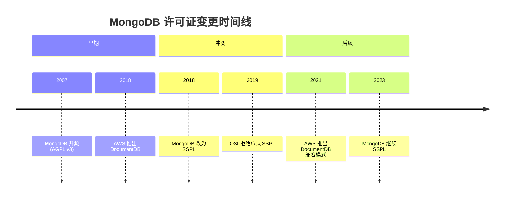
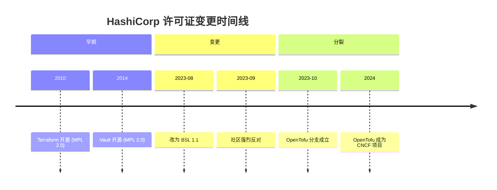
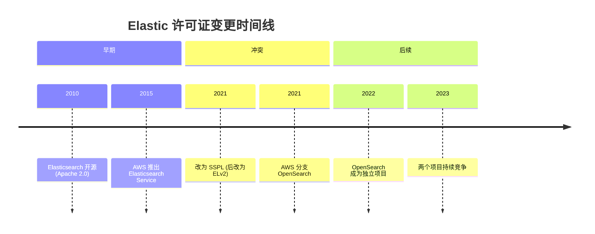
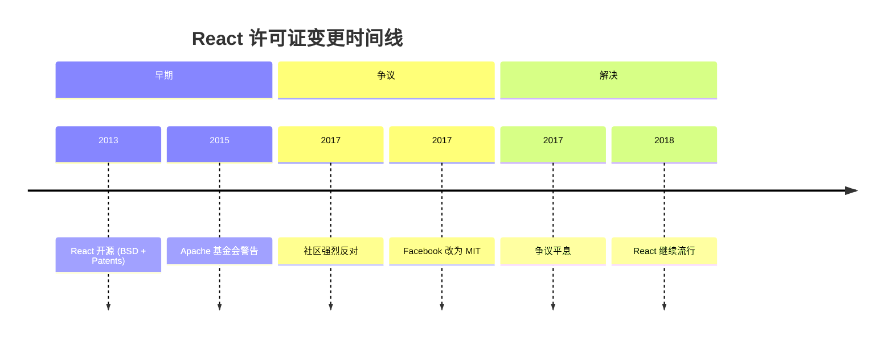
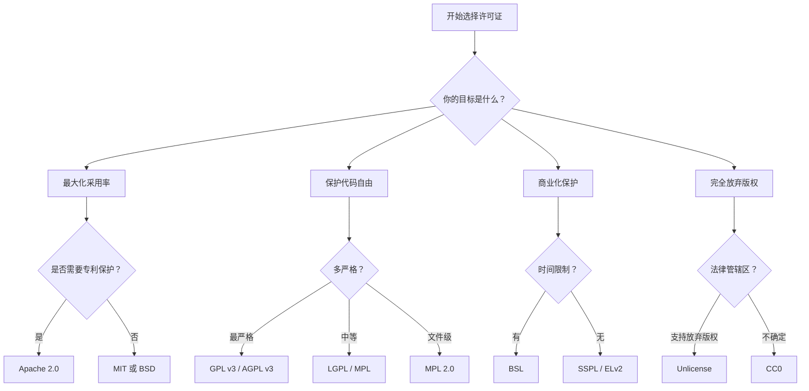

# 【硬核指南】开源许可证全景：从MIT到GPL，那些协议背后的故事与战争 🔓

**作者：** GLM4.7
**时间：** 2026年2月
**字数：** 约8000字
**阅读时间：** 25分钟

> 在开源的世界里，代码是自由的，但"自由"的定义，从来都不简单。一纸许可证，轻则决定一个项目的命运，重则引发价值数十亿美元的诉讼。本文将带你走进开源许可证的完整世界，以及那些因许可证而起的腥风血雨。

---

## 📑 目录

- [第一章：理解开源许可证](#第一章理解开源许可证)
- [第二章：宽松型许可证（Permissive Licenses）](#第二章宽松型许可证permissive-licenses)
- [第三章：Copyleft 型许可证](#第三章copyleft-型许可证)
- [第四章：弱 Copyleft 型许可证](#第四章弱-copyleft-型许可证)
- [第五章：新时代的"源码可用"许可证](#第五章新时代的源码可用许可证)
- [第六章：其他与特殊许可证](#第六章其他与特殊许可证)
- [第七章：许可证争议故事集](#第七章许可证争议故事集)
- [第八章：如何选择许可证](#第八章如何选择许可证)
- [附录：许可证速查对比表](#附录许可证速查对比表)

---

## 第一章：理解开源许可证

### 1.1 为什么需要许可证？

很多人有一个误解：**"代码放在 GitHub 上就是开源的，谁都可以随便用。"**

**大错特错。**

根据各国版权法（如《伯尔尼公约》），任何创作作品在创作完成的那一刻就自动获得版权保护。如果你把代码放到 GitHub 上却不附加任何许可证，那么**默认情况下没有人有权使用、复制、修改或分发你的代码**——哪怕它是公开可见的。

许可证就是作者向世界发出的一份"授权声明"，告诉别人：

- ✅ 你**可以**用我的代码做什么
- ❌ 你**不可以**做什么
- 📋 你需要**遵守**什么条件

### 1.2 许可证的三大阵营

```
┌─────────────────────────────────────────────────────┐
│                  开源许可证光谱                        │
│                                                      │
│  宽松 ◄──────────────────────────────────────► 严格   │
│                                                      │
│  MIT    Apache   MPL    LGPL    GPL    AGPL    SSPL   │
│  BSD    ISC             EPL           Copyleft        │
│  Unlicense                                           │
│                                                      │
│  "随便用"          "有条件地用"        "必须也开源"     │
└─────────────────────────────────────────────────────┘
```

| 阵营 | 核心理念 | 代表 |
|------|---------|------|
| **宽松型（Permissive）** | "拿去用吧，标注一下出处就行" | MIT, BSD, Apache 2.0 |
| **Copyleft 型** | "你可以用，但衍生作品也必须开源" | GPL, AGPL |
| **源码可用型（Source Available）** | "你可以看代码，但不能随便商用" | SSPL, BSL, Elastic License |

---

## 第二章：宽松型许可证（Permissive Licenses）

### 2.1 MIT License —— 开源世界的"万金油"

```text
MIT License

Copyright (c) [year] [fullname]

Permission is hereby granted, free of charge, to any person obtaining a copy
of this software and associated documentation files (the "Software"), to deal
in the Software without restriction, including without limitation the rights
to use, copy, modify, merge, publish, distribute, sublicense, and/or sell
copies of the Software, and to permit persons to whom the Software is
furnished to do so, subject to the following conditions:

The above copyright notice and this permission notice shall be included in all
copies or substantial portions of the Software.

THE SOFTWARE IS PROVIDED "AS IS", WITHOUT WARRANTY OF ANY KIND...
```

**起源**：诞生于麻省理工学院（MIT），是目前 GitHub 上最流行的开源许可证。

**核心规则**：
- ✅ 可以商业使用
- ✅ 可以修改
- ✅ 可以分发
- ✅ 可以私有化（闭源使用）
- 📋 唯一要求：保留版权声明和许可证文本
- ❌ 无担保责任

**使用者**：jQuery, Rails, Node.js, React（后来改回的版本）, Vue.js, .NET Core, Babel, Lodash...

**为什么这么流行？** 因为它只有一个实质性要求——保留版权声明。企业法务几乎不会对 MIT 许可证提出任何异议，这使得 MIT 项目极容易被商业公司采用。

> 🗣️ "MIT 许可证短到可以印在一张名片上。" —— 开源社区流行语

---

### 2.2 BSD License —— 比MIT更老的元老

BSD 许可证有多个变体，来自加州大学伯克利分校（Berkeley Software Distribution）：

#### 2-Clause BSD（简化BSD / FreeBSD许可证）

```text
Copyright (c) [year], [owner]
Redistribution and use in source and binary forms, with or without
modification, are permitted provided that the following conditions are met:

1. Redistributions of source code must retain the above copyright notice...
2. Redistributions in binary form must reproduce the above copyright notice...

THIS SOFTWARE IS PROVIDED BY THE COPYRIGHT HOLDERS "AS IS"...
```

与 MIT 基本等价，只是措辞不同。

#### 3-Clause BSD（新BSD / 修订BSD）

在 2-Clause 基础上增加了一条：
> **未经事先书面许可，不得使用版权持有者的名字为衍生产品背书或做推广。**

#### 4-Clause BSD（原始BSD）—— 已不推荐

额外增加了一条臭名昭著的"广告条款"：
> 所有提及此软件功能或使用的广告材料都必须显示以下声明："本产品包含由加州大学伯克利分校及其贡献者开发的软件。"

这条规定导致了一个严重问题：当一个系统包含几十个不同的 BSD 组件时，每个组件都要求在广告中提及自己，导致广告变得冗长无比。1999年，伯克利官方正式废除了这一条款。

**使用者**：FreeBSD, NetBSD, Nginx (早期)

---

### 2.3 Apache License 2.0 —— 企业级的宽松

```text
                                 Apache License
                           Version 2.0, January 2004
                        http://www.apache.org/licenses/
```

**起源**：Apache 软件基金会，为 Apache HTTP Server 而创建。

**核心规则**：
- ✅ 与 MIT/BSD 类似的宽松权利
- 📋 保留版权声明
- 📋 **标注修改内容**（如果你修改了代码，需要在修改的文件中说明）
- 📋 **专利授权**：贡献者自动将相关专利权授予用户
- 📋 如果项目中有 `NOTICE` 文件，衍生版本必须包含它
- ⚠️ **专利报复条款**：如果你用 Apache 授权的软件去起诉别人专利侵权，你的许可证将自动终止

**与 MIT 的关键区别**：**专利保护**。MIT 没有明确的专利条款，而 Apache 2.0 明确授予了专利使用权，并且包含专利报复条款。这对企业级项目非常重要。

**使用者**：Android (AOSP), Kubernetes, Swift, TensorFlow, Hadoop, Kafka, Spark

> 💡 **小知识**：Google 的大部分开源项目都使用 Apache 2.0，因为其专利条款为 Google 提供了法律保护。

---

### 2.4 ISC License —— 更精简的MIT

```text
Copyright [year] [owner]

Permission to use, copy, modify, and/or distribute this software for any
purpose with or without fee is hereby granted, provided that the above
copyright notice and this permission notice appear in all copies.

THE SOFTWARE IS PROVIDED "AS IS"...
```

由 Internet Systems Consortium 创建，被认为是 MIT/BSD 的功能等价但措辞更简洁的版本。OpenBSD 项目偏好此许可证。

**使用者**：OpenBSD 生态项目, npm 早期默认许可证

---

### 2.5 Unlicense —— 彻底放弃一切权利

```text
This is free and unencumbered software released into the public domain.

Anyone is free to copy, modify, publish, use, compile, sell, or distribute
this software...
```

**理念**：将软件完全放入公共领域，放弃所有版权。

**争议**：在某些法律管辖区（如德国），著作权被认为是不可放弃的人身权利。所以 Unlicense 在部分国家可能存在法律效力问题。

---

### 2.6 WTFPL —— 最"豪放"的许可证

```text
        DO WHAT THE FUCK YOU WANT TO PUBLIC LICENSE
                    Version 2, December 2004

 Copyright (C) 2004 Sam Hocevar <sam@hocevar.net>

 Everyone is permitted to copy and distribute verbatim or modified
 copies of this license document, and changing it is allowed as long
 as the name is changed.

            DO WHAT THE FUCK YOU WANT TO PUBLIC LICENSE
   TERMS AND CONDITIONS FOR COPYING, DISTRIBUTION AND MODIFICATION

  0. You just DO WHAT THE FUCK YOU WANT TO.
```

全称 "Do What The F**k You Want To Public License"，只有一条条款：**你想干嘛就干嘛**。

虽然很有趣，但大多数公司的法务部门不会认可它，因为它缺少明确的免责声明。FSF（自由软件基金会）认为它是一个兼容 GPL 的自由软件许可证。

---

### 2.7 CC0 (Creative Commons Zero) —— 学术界的公共领域工具

Creative Commons 组织设计的"公共领域贡献工具"。严格来说它不是一个许可证，而是一份放弃声明，并附带了一个宽松的后备许可证（针对无法放弃版权的司法管辖区）。

**常用于**：数据集、文档、规范，有时也用于软件（如 SQLite）。

> ⚠️ **注意**：CC 系列许可证（CC BY, CC BY-SA, CC BY-NC 等）官方不推荐用于软件，它们是为内容创作设计的。

---

### 2.8 zlib License

```text
Copyright (c) [year] [owner]

This software is provided 'as-is', without any express or implied warranty...

Permission is granted to anyone to use this software for any purpose,
including commercial applications, and to alter it and redistribute it freely,
subject to the following restrictions:

1. The origin of this software must not be misrepresented...
2. Altered source versions must be plainly marked as such...
3. This notice may not be removed or altered from any source distribution.
```

在游戏开发和底层库中常见。与 MIT/BSD 类似，但额外要求：不能虚假声称自己是原始作者、修改版本必须明确标注。

**使用者**：zlib 压缩库、很多游戏引擎中的组件

---

### 2.9 Boost Software License

C++ Boost 库使用的许可证。类似 MIT，但甚至更宽松——在发布二进制文件时，**不需要**附带许可证文本。

**使用者**：Boost C++ Libraries

---

## 第三章：Copyleft 型许可证

### 3.1 GPL（GNU General Public License）—— 自由软件运动的灵魂

这是整个开源世界中最具争议性、最有影响力的许可证家族。

#### 起源故事

1983年，**Richard Stallman（理查德·斯托曼）** 在 MIT 人工智能实验室工作时，遭遇了一件让他愤怒的事：实验室新来的 Xerox 激光打印机经常卡纸，Stallman 想修改打印机驱动程序让它在卡纸时通知用户，但 Xerox 拒绝提供源代码。

这件事成了压死骆驼的最后一根稻草。Stallman 认为软件应该是自由的，用户应该有权运行、研究、修改和分发软件。他发起了 **GNU 计划**，并创造了 **GPL** 来确保软件的自由不会被夺走。

GPL 的核心哲学不是"无条件的赠予"，而是 **"传染性的自由"**——你可以自由使用我的代码，但如果你基于它创作衍生作品，你也必须以同样的方式开放源代码。

#### GPL v2（1991）

```text
GNU GENERAL PUBLIC LICENSE
Version 2, June 1991
```

**核心规则**：
- ✅ 自由使用、修改、分发
- 📋 **衍生作品必须也以 GPL v2 发布**（这就是"Copyleft"或"传染性"）
- 📋 必须提供源代码（或提供获取源代码的方式）
- 📋 保留版权声明
- ❌ 不能添加额外的限制

**关键概念——"衍生作品"**：这是 GPL 中最有争议的概念。什么算衍生作品？

- 修改 GPL 代码并发布 → 明确是衍生作品
- 将 GPL 代码静态链接到你的程序 → 通常被认为是衍生作品
- 将 GPL 代码动态链接到你的程序 → **灰色地带！** FSF 认为是，但有人不同意
- 仅仅在同一台机器上运行 GPL 软件 → 不是
- 通过网络 API 调用 GPL 服务 → 不是（这就是 AGPL 想要解决的漏洞）

**使用者**：Linux 内核（v2 only）, Git, WordPress, MariaDB, GIMP

> 🗣️ Linus Torvalds："我认为 GPLv2 是我做过的最好的决定之一。它让那些想参与的人觉得自己的贡献会被保护，不会被某个人拿去做成专有产品。"

#### GPL v3（2007）

在 v2 的基础上增加了：

1. **反 Tivoization 条款**：TiVo 公司用了 Linux 内核（GPL v2），但通过硬件签名验证阻止用户在设备上运行修改后的软件。GPLv3 明确禁止这种行为——如果你分发 GPL v3 的软件，你必须提供用户在原始硬件上安装修改版本的能力。

2. **明确的专利授权**：类似 Apache 2.0 的专利条款。

3. **反 DRM 条款**：不得使用 GPL v3 软件作为实施 DRM（数字版权管理）的手段。

4. **更好的国际化**：v2 的措辞基于美国版权法，v3 做了调整以适应不同法律体系。

**Linus Torvalds 拒绝了 GPL v3**：Linux 内核至今仍然使用 GPL v2，Linus 认为 v3 的 anti-Tivoization 条款过于极端，超出了他对"代码自由"的定义范围。

> 🗣️ Linus Torvalds："我只关心代码。GPL v2 保护代码的自由，GPLv3 试图控制硬件，那不是我想要的。"

**使用者**：GCC (从 v3 开始迁移), GNU 系列工具, Samba

---

### 3.2 AGPL（GNU Affero General Public License）v3 —— 堵上SaaS的漏洞

**问题背景**：在 SaaS（软件即服务）时代，GPL 有一个巨大的漏洞。

GPL 只要求在**分发**软件时提供源代码。但 Google、Amazon 等公司可以在自己的服务器上运行修改后的 GPL 软件来提供网络服务，因为它们并没有"分发"软件给用户——用户只是通过浏览器访问服务。

**AGPL 的解决方案**：增加了"网络交互"条款。如果你在服务器上运行修改后的 AGPL 软件并通过网络向用户提供服务，你也必须向那些用户提供源代码。

**核心规则**：
- 📋 GPL v3 的所有要求
- 📋 **额外要求**：通过网络与用户交互时也必须提供源代码

**使用者**：MongoDB（曾经，后来改为 SSPL）, Grafana（后来改为 AGPLv3）, Nextcloud, Mastodon

> ⚠️ **企业恐惧**：很多公司在内部政策中明确禁止使用 AGPL 软件。Google 内部就有这样的规定，因为 AGPL 的"传染性"太强，可能导致公司不得不开源自己的专有代码。

---

## 第四章：弱 Copyleft 型许可证

### 4.1 LGPL（GNU Lesser General Public License）

**设计目的**：在 GPL 的严格性和宽松许可证之间找一个平衡点，专门为**库（Library）** 设计。

**核心规则**：
- 📋 如果你**修改了 LGPL 库本身**，修改后的库必须以 LGPL 发布
- ✅ 但如果你只是**使用/链接** LGPL 库（不修改它），你的主程序**不需要**开源
- 📋 必须允许用户替换 LGPL 库的版本（所以通常要求动态链接）

**实际影响**：这意味着你可以在商业闭源软件中使用 LGPL 库，只要你通过动态链接的方式使用它。

**使用者**：GNU C Library (glibc), Qt (双许可), FFmpeg 的部分组件, LGPL 部分的 VLC

---

### 4.2 MPL 2.0（Mozilla Public License）—— 文件级的Copyleft

```text
Mozilla Public License Version 2.0
```

**设计目的**：一种"折中"许可证，Copyleft 效力限制在**单个文件**级别。

**核心规则**：
- 📋 修改了 MPL 授权的**文件** → 该文件必须以 MPL 开源
- ✅ 你可以在同一个项目中添加新的、使用不同许可证的文件
- ✅ 整个项目可以是闭源的，只要 MPL 文件保持开源
- 📋 明确的专利授权

**为什么有人喜欢它？** 它比 GPL 灵活（不会"感染"整个项目），但比 MIT 有更多保护（至少修改的文件必须回馈社区）。

**使用者**：Firefox, Thunderbird, LibreOffice (部分), Terraform (曾经，后改为 BSL)

---

### 4.3 EPL（Eclipse Public License）

Eclipse 基金会创建的许可证，概念上类似 MPL，但以"模块"为 Copyleft 边界。

**使用者**：Eclipse IDE, JUnit (曾经使用 EPL)

---

### 4.4 CDDL（Common Development and Distribution License）

Sun Microsystems 创建，基于 MPL 1.1 修改。文件级 Copyleft。

**特别之处**：CDDL 与 GPL 不兼容，这曾经是一个大问题（见后文 ZFS 的故事）。

**使用者**：OpenSolaris, ZFS (OpenZFS)

---

## 第五章：新时代的"源码可用"许可证

近年来，一些公司在云计算巨头的压力下，创造了一类新的许可证。这些许可证允许你查看和使用源代码，但在商业使用上有严格限制。**它们通常不被 OSI（开放源代码促进会）认可为"开源"许可证。**

### 5.1 SSPL（Server Side Public License）

**创建者**：MongoDB, Inc.（2018年）

**背景**：MongoDB 最初使用 AGPL v3。但 AWS 推出了 DocumentDB（一个兼容 MongoDB 协议的数据库服务），直接与 MongoDB Atlas 竞争，而且 AWS 不需要开源自己的云平台代码。MongoDB 认为 AGPL 不够强，于是创建了 SSPL。

**核心规则**：
- 基于 GPL v3 修改
- 📋 如果你将 SSPL 软件作为服务提供给第三方，你必须**开源你整个服务的完整源代码**——包括管理软件、用户界面、应用程序接口、自动化软件、监控软件、备份软件、存储软件和托管软件等

这个要求如此之广泛，以至于实际上没有任何云服务商能够合规——这正是 MongoDB 的目的。

**OSI 的态度**：OSI 拒绝承认 SSPL 为开源许可证，认为它的要求过于宽泛，实际上是一种"反竞争"工具。

---

### 5.2 BSL（Business Source License / MariaDB 商业源码许可证）

**创建者**：MariaDB Corporation（2013年）

**独特机制**：带有"时间锁"的许可证。

**核心规则**：
- 源代码完全可见
- ✅ 可以用于非生产环境（开发、测试、个人使用）
- ❌ 不能用于生产环境的商业用途（或受"额外使用授权"限制）
- ⏰ **在指定日期后（通常是发布后 3-4 年），代码自动转为真正的开源许可证**（通常是 Apache 2.0 或 GPL）

**为什么这个设计很聪明？** 它给了公司一个窗口期来商业化，同时承诺代码最终会完全开源。

**使用者**：
- **HashiCorp**（2023年将 Terraform, Vault, Consul 等从 MPL 2.0 改为 BSL 1.1）
- **MariaDB** MaxScale
- **CockroachDB**
- **Sentry**（后来）
- **Couchbase**

---

### 5.3 Elastic License 2.0 (ELv2)

**创建者**：Elastic N.V.（2021年）

**背景**：为了应对 AWS 推出 Amazon Elasticsearch Service 与 Elastic 竞争。

**核心规则**：
- ✅ 免费使用、修改、分发
- ❌ 不能作为托管/管理服务提供给第三方
- ❌ 不能绕过许可证密钥功能或删除许可证保护
- ❌ 不能删除版权声明

---

### 5.4 Commons Clause

**不是一个独立许可证**，而是一个可以附加在任何开源许可证之上的**限制条款**。

```text
"Commons Clause" License Condition v1.0

The Software is provided to you by the Licensor under the License,
as defined below, subject to the following condition.

Without limiting other conditions in the License, the grant of rights under
the License will not include, and the License does not grant to you, the
right to Sell the Software.
```

简单说就是在原有许可证基础上加一条：**你不能卖这个软件。**

**使用者**：Redis 的某些模块（曾经，后改为其他许可证）

**争议**：遭到开源社区的强烈反对，因为它把原本开源的软件变成了"非开源"，但仍然保留原许可证的名字，容易误导人。

---

### 5.5 FSL（Functional Source License）

**创建者**：Sentry（2023年提出）

**理念**：对 BSL 的改进版。发布后两年自动转为 Apache 2.0 或 MIT。在两年的保护期内，唯一限制是不能用它来提供与原作者竞争的产品/服务。

---

## 第六章：其他与特殊许可证

### 6.1 双重许可（Dual Licensing）

这是一种商业模式，而不是单一的许可证。

**工作原理**：
- 同一个软件提供两种许可证选择
- **开源版本**：使用 GPL/AGPL，要求用户也开源
- **商业版本**：付费购买，可以闭源使用

**使用者**：
- **Qt**：LGPL（开源）vs 商业许可
- **MySQL/MariaDB**：GPL（开源）vs 商业许可
- **WooCommerce**：GPL（开源）vs 商业许可

**为什么有效？** 企业通常不愿意开源自己的代码，所以愿意付费购买商业许可。这为开源项目提供了可持续的收入来源。

---

### 6.2 Artistic License 2.0

Perl 语言使用的许可证。它是一种 Copyleft 许可证，但比 GPL 更宽松，允许在特定情况下将代码与专有代码链接。

**使用者**：Perl, Parrot VM

---

### 6.3 CDDL + GPL 的兼容性问题

这是一个技术细节，但对某些项目至关重要。

**问题**：CDDL 和 GPL 不兼容。这意味着：
- 你不能将 CDDL 代码和 GPL 代码放在同一个项目中
- Linux 内核（GPL v2）不能直接包含 ZFS（CDDL）

**解决方案**：
- 使用单独的内核模块加载 ZFS
- 或者在 CDDL 项目中重新实现 GPL 代码

---

## 第七章：许可证争议故事集

### 7.1 MongoDB vs AWS —— 云计算时代的许可证战争

**时间线**：



**故事**：

MongoDB 最初使用 AGPL v3 开源。2018年，AWS 推出了 DocumentDB——一个兼容 MongoDB 协议的数据库服务。AWS 使用了 MongoDB 的开源代码，但没有回馈社区，而是用它来与 MongoDB 自己的云服务 Atlas 竞争。

MongoDB 认为 AGPL 不够强，因为 AWS 并没有"分发"软件，只是提供服务。于是 MongoDB 创建了 SSPL，要求任何提供 MongoDB 服务的公司必须开源整个服务的代码。

**结果**：
- AWS 无法合规使用 SSPL 版本的 MongoDB
- MongoDB Atlas 仍然是主要的云服务提供商
- 其他云服务商（如 Azure、Google Cloud）也受到影响
- 开源社区对 SSPL 的态度两极分化

---

### 7.2 HashiCorp 的许可证变更 —— 基础设施即代码的危机

**时间线**：



**故事**：

2023年8月，HashiCorp 宣布将其核心产品（Terraform、Vault、Consul 等）从 MPL 2.0 改为 BSL 1.1。这意味着：
- 代码仍然开源可见
- 但不能用于生产环境的商业用途
- 4年后会自动转为 MPL 2.0

**社区反应**：
- 开发者感到被背叛
- 担心 HashiCorp 会限制竞争
- 担心 BSL 的"商业用途"定义模糊

**OpenTofu 的诞生**：
- Linux 基金会支持的开源分支
- 继续使用 MPL 2.0
- 成为 Terraform 的替代品
- 2024年加入 CNCF（云原生计算基金会）

---

### 7.3 Elastic vs AWS —— 搜索引擎的许可证之战

**时间线**：



**故事**：

Elasticsearch 最初使用 Apache 2.0 许可证。2015年，AWS 推出了 Amazon Elasticsearch Service，直接与 Elastic 的云服务竞争。

2021年，Elastic 将 Elasticsearch 和 Kibana 从 Apache 2.0 改为 SSPL（后改为 ELv2）。AWS 无法接受这个许可证，于是创建了 OpenSearch——一个基于 Elasticsearch 的开源分支。

**结果**：
- Elasticsearch 和 OpenSearch 成为两个竞争项目
- OpenSearch 被 AWS 大力推广
- Elastic 继续维护自己的版本
- 社区分裂，用户需要选择

---

### 7.4 ZFS vs Linux 内核 —— 许可证兼容性的经典案例

**问题**：

ZFS 文件系统使用 CDDL 许可证，而 Linux 内核使用 GPL v2。这两个许可证不兼容，导致：
- ZFS 无法直接合并到 Linux 内核主线
- 用户需要单独编译 ZFS 模块
- 发行版需要特殊处理

**历史**：

- 2005年：Sun Microsystems 开源 ZFS（CDDL）
- 2010年：Oracle 收购 Sun，ZFS 发展放缓
- 2013年：OpenZFS 项目成立，继续开发
- 至今：ZFS 仍然无法进入 Linux 内核主线

**解决方案**：
- Ubuntu 等发行版通过 DKMS（动态内核模块支持）提供 ZFS
- 用户可以手动编译 ZFS 模块
- 但这不是官方支持的方式

---

### 7.5 React 的许可证风波 —— BSD + Patents 的争议

**时间线**：



**故事**：

React 最初使用一个特殊的许可证：**BSD 许可证 + 额外的专利条款**。这个专利条款规定：
- 如果你起诉 Facebook 专利侵权，你的 React 许可证自动终止
- Facebook 保留对 React 相关专利的权利

**问题**：
- 这个条款对大公司（如 Google、Microsoft）不可接受
- Apache 基金会正式警告不要使用这个许可证
- 许多公司禁止使用 React

**结局**：
2017年，在社区压力下，Facebook 将 React 改为标准的 MIT 许可证。争议平息，React 继续成为最流行的前端框架之一。

---

## 第八章：如何选择许可证

### 8.1 决策树



### 8.2 场景推荐

#### 场景 1：你想让尽可能多的人使用你的代码

**推荐**：MIT 或 Apache 2.0

**理由**：
- 企业法务最容易接受
- 没有复杂的限制
- 社区采用率最高

**选择 MIT 如果**：
- 你不需要专利保护
- 你想要最简单的许可证

**选择 Apache 2.0 如果**：
- 你需要明确的专利授权
- 你使用 `NOTICE` 文件
- 你希望标注修改内容

---

#### 场景 2：你想确保衍生作品也必须开源

**推荐**：GPL v3 或 AGPL v3

**选择 GPL v3 如果**：
- 你开发的是桌面/移动应用
- 你希望衍生作品也开源
- 你需要反 Tivoization 保护

**选择 AGPL v3 如果**：
- 你开发的是网络服务（SaaS）
- 你希望防止云服务商"白嫖"你的代码
- 你希望网络交互也触发开源义务

---

#### 场景 3：你想开发一个库，但允许商业闭源使用

**推荐**：LGPL 或 MPL 2.0

**选择 LGPL 如果**：
- 你开发的是系统库（如 C 库）
- 你希望用户可以静态或动态链接
- 你不希望"感染"整个项目

**选择 MPL 2.0 如果**：
- 你希望文件级 Copyleft
- 你允许混合不同许可证的文件
- 你需要明确的专利授权

---

#### 场景 4：你想商业化你的开源项目

**推荐**：双重许可（Dual Licensing）

**方案**：
- 开源版本：GPL/AGPL
- 商业版本：付费购买

**适用项目**：
- 数据库（如 MySQL）
- 开发工具（如 Qt）
- 企业级软件

**注意**：这需要强大的社区支持和商业团队。

---

#### 场景 5：你想防止云服务商"白嫖"你的代码

**推荐**：BSL 或 SSPL

**选择 BSL 如果**：
- 你希望代码最终会开源（3-4年后）
- 你需要商业化窗口期
- 你希望社区能接受

**选择 SSPL 如果**：
- 你不在乎 OSI 认可
- 你希望完全阻止云服务商
- 你接受社区分裂的风险

---

### 8.3 避坑指南

#### ❌ 不要做的事

1. **不要使用不兼容的许可证混合代码**
   - GPL 和 CDDL 不能混用
   - GPL 和某些私有许可证不能混用

2. **不要随意更改许可证**
   - 一旦发布，很难更改
   - 社区会感到被背叛
   - 可能导致分支（如 OpenTofu）

3. **不要忽视专利条款**
   - MIT 没有明确的专利保护
   - Apache 2.0 有明确的专利授权
   - 企业项目需要考虑专利问题

4. **不要忘记 `NOTICE` 文件**
   - Apache 2.0 要求保留 `NOTICE` 文件
   - 遗忘可能导致许可证违规

---

#### ✅ 应该做的事

1. **在项目开始时就选择许可证**
   - 不要等到项目大了再改
   - 早期选择更容易

2. **在每个源文件中包含许可证声明**
   - 顶部添加版权声明
   - 明确说明许可证类型

3. **提供 `LICENSE` 文件**
   - 在项目根目录添加
   - 使用完整的许可证文本

4. **记录第三方依赖**
   - 列出所有依赖的许可证
   - 确保许可证兼容性
   - 使用工具（如 `license-checker`）

---

## 附录：许可证速查对比表

### A.1 核心许可证对比

| 许可证 | 商业使用 | 修改 | 分发 | 私有使用 | 专利授权 | Copyleft | OSI认可 |
|:---|:---:|:---:|:---:|:---:|:---:|:---:|:---:|
| **MIT** | ✅ | ✅ | ✅ | ✅ | ❌ | ❌ | ✅ |
| **BSD 2-Clause** | ✅ | ✅ | ✅ | ✅ | ❌ | ❌ | ✅ |
| **BSD 3-Clause** | ✅ | ✅ | ✅ | ✅ | ❌ | ❌ | ✅ |
| **Apache 2.0** | ✅ | ✅ | ✅ | ✅ | ✅ | ❌ | ✅ |
| **ISC** | ✅ | ✅ | ✅ | ✅ | ❌ | ❌ | ✅ |
| **Unlicense** | ✅ | ✅ | ✅ | ✅ | ❌ | ❌ | ✅ |
| **GPL v2** | ✅ | ✅ | ✅ | ❌ | ❌ | ✅ 强 | ✅ |
| **GPL v3** | ✅ | ✅ | ✅ | ❌ | ✅ | ✅ 强 | ✅ |
| **AGPL v3** | ✅ | ✅ | ✅ | ❌ | ✅ | ✅ 强+网络 | ✅ |
| **LGPL** | ✅ | ✅ | ✅ | ✅ | ❌ | ✅ 弱 | ✅ |
| **MPL 2.0** | ✅ | ✅ | ✅ | ✅ | ✅ | ✅ 文件级 | ✅ |
| **EPL** | ✅ | ✅ | ✅ | ✅ | ✅ | ✅ 文件级 | ✅ |
| **CDDL** | ✅ | ✅ | ✅ | ✅ | ✅ | ✅ 文件级 | ✅ |
| **SSPL** | ⚠️ | ✅ | ✅ | ❌ | ✅ | ✅ 超强 | ❌ |
| **BSL** | ⚠️ | ✅ | ✅ | ✅ | ✅ | ⏰ 时间锁 | ❌ |
| **ELv2** | ⚠️ | ✅ | ✅ | ✅ | ✅ | ❌ | ❌ |

### A.2 Copyleft 强度对比

```
┌─────────────────────────────────────────────────────┐
│              Copyleft 强度光谱                         │
│                                                      │
│  弱 ◄──────────────────────────────────────► 强      │
│                                                      │
│  MIT    MPL    LGPL    GPL    AGPL    SSPL           │
│  BSD    EPL    CDDL    v3                                    │
│  Apache                                              │
│                                                      │
│  "不感染"    "文件级"   "库级"   "项目级"  "服务级"   │
└─────────────────────────────────────────────────────┘
```

### A.3 许可证兼容性矩阵

| | MIT | Apache 2.0 | GPL v2 | GPL v3 | LGPL | MPL 2.0 |
|:---|:---:|:---:|:---:|:---:|:---:|:---:|
| **MIT** | ✅ | ✅ | ✅ | ✅ | ✅ | ✅ |
| **Apache 2.0** | ✅ | ✅ | ⚠️ | ✅ | ✅ | ✅ |
| **GPL v2** | ✅ | ⚠️ | ✅ | ❌ | ✅ | ❌ |
| **GPL v3** | ✅ | ✅ | ❌ | ✅ | ✅ | ❌ |
| **LGPL** | ✅ | ✅ | ✅ | ✅ | ✅ | ✅ |
| **MPL 2.0** | ✅ | ✅ | ❌ | ❌ | ✅ | ✅ |

**图例**：
- ✅ = 兼容
- ❌ = 不兼容
- ⚠️ = 部分兼容，需要注意

### A.4 常见问题 FAQ

#### Q1: 我可以修改许可证吗？

**A**: 不可以。一旦你使用了某个许可证，其他人就获得了该许可证授予的权利。你不能单方面更改已经授予的权利。

**例外**：
- 你是唯一的贡献者，可以更改未来版本的许可证
- 你可以要求贡献者签署 CLA（贡献者许可协议）

---

#### Q2: 我可以在项目中使用不同许可证的代码吗？

**A**: 取决于许可证的兼容性。

**规则**：
- 检查许可证兼容性矩阵
- 确保最终项目满足所有许可证的要求
- 可能需要将某些代码分离为独立模块

---

#### Q3: 我忘记添加许可证会怎样？

**A**: 默认情况下，没有人有权使用你的代码。

**后果**：
- 用户无法合法使用你的代码
- 企业不会采用你的项目
- 可能导致法律纠纷

**解决方案**：
- 尽快添加许可证
- 明确说明许可证适用于所有版本

---

#### Q4: 我可以将 GPL 代码用于商业项目吗？

**A**: 可以，但你需要开源整个项目。

**条件**：
- 你必须以 GPL 开源你的代码
- 你必须提供源代码
- 你不能添加额外的限制

**替代方案**：
- 使用 LGPL（如果是库）
- 使用双重许可（付费购买商业许可）
- 不使用 GPL 代码

---

#### Q5: 什么是"衍生作品"？

**A**: 这是一个法律概念，通常指基于原作品创作的作品。

**在软件中**：
- 修改代码并发布 → 衍生作品
- 静态链接 → 通常认为是衍生作品
- 动态链接 → 有争议
- 通过 API 调用 → 通常不是衍生作品

**建议**：
- 咨询法律专家
- 使用明确的许可证（如 LGPL）
- 避免灰色地带

---

## 🎯 总结

开源许可证是开源生态系统的基石。选择合适的许可证，就像选择项目的"宪法"——它决定了你的项目如何被使用、如何发展、如何影响世界。

**核心要点**：

1. **没有许可证 = 无人可用**：不要忘记添加许可证
2. **MIT/Apache = 最大采用**：如果你想最大化影响力
3. **GPL/AGPL = 保护自由**：如果你想确保代码自由
4. **BSL/SSPL = 商业保护**：如果你想防止云服务商"白嫖"
5. **许可证兼容性很重要**：不要混合不兼容的许可证

**记住**：许可证不是法律建议。如果你有复杂的法律问题，请咨询专业的知识产权律师。

---

## 📚 参考资源

- [Choose a License](https://choosealicense.com/)
- [Open Source Initiative (OSI)](https://opensource.org/)
- [GNU General Public License](https://www.gnu.org/licenses/gpl-3.0.html)
- [Apache License 2.0](https://www.apache.org/licenses/LICENSE-2.0)
- [TLDRLegal](https://www.tldrlegal.com/)

---

**🔗 相关文章推荐：**
- [2025年科学上网协议战力排行榜](/2025年科学上网协议战力排行榜/)
- [【GFW对抗史·第一章】传统VPN的黄金时代与落幕](/GFW对抗史第一章/)
- [勾股定理及其证明方法](/勾股定理及其证明方法/)
